Fitness Tracker Trend Analysis
================
Adelia Ramadhani
1/11/2022

## **Overview**

[Bellabeat](https://bellabeat.com/?) is a women-centric tech and
wellness company which develops wearables and accompanying products that
monitor biometric and lifestyle data to help women better understand how
their bodies work, and as a result, make healthier lifestyle choices.

Together with the Bellabeat app, users are able to gain insights with
health data related to their activity, sleep, stress, fitness, heart
rate, reproductive health and mindfulness habits.

The aim of this project is to analyze how non-Bellabeat consumers use
their smart fitness devices. With this information, we are to provide
high-level recommendations for how these insights can inform Bellabeat’s
marketing strategy.

This analysis consists of 6 phase: **Ask, Prepare, Process, Analyze,
Share** and **Act**.

## **Ask Phase**

To begin the analysis, we need to ask questions and problem-solve. In
this Ask phase, we need to identify the business task, the questions
that needs to be answered, and the stakeholders. These aspects will
guide us through the entire process of the data analysis.

### **1. Business Task**

-   Analyze Fitbit data to gain insight into how consumers use
    non-Bellabeat smart devices.

-   Select one Bellabeat product and apply these insights into a
    presentation.

-   Provide high-level recommendations for Bellabeat’s marketing
    strategy.

### **2. Questions for The Analysis**

-   What are some trends in smart device usage?

-   How could these trends apply to Bellabeat customers?

-   How could these trends help influence Bellabeat’s marketing
    strategy?

### **3. Stakeholders**

-   Urška Sršen: Bellabeat’s cofounder and Chief Creative Officer.

-   Sando Mur: Mathematician and Bellabeat’s cofounder.

-   Bellabeat Marketing Analytics team.

## **Prepare Phase**

This phase will help us to make use the right data for our objectives
and how to organize and protect the data so that we can process them in
the next phase.

### **1. Data Sources**

The data source used for our case study is FitBit Fitness Tracker Data.
This dataset is stored in Kaggle and was made available through Mobius.

-   Source Used: [FitBit Fitness Tracker
    Data](https://www.kaggle.com/arashnic/fitbit) (CC0: Public Domain
    Kaggle dataset made available through Mobius,
    04.12.2016-05.12.2016).

-   [Original Source:](https://zenodo.org/record/53894#.Ybzqy9nMK8X)
    Furberg, R., Brinton, J., Keating, M., & Ortiz, A. (2016).
    Crowd-sourced Fitbit datasets 03.12.2016-05.12.2016 Zenodo.

### **2. Accessibility and Privacy of the Data**

Verifying the metadata of our dataset we can confirm it is open-source.
The owner has dedicated the work to the public domain by waiving all of
their rights to the work worldwide under copyright law, including all
related and neighboring rights, to the extent allowed by law. We can
copy, modify, distribute and perform the work, even for commercial
purposes, all without asking permission.

### **3. Other Information about the Dataset**

-   These datasets were generated by respondents to a distributed survey
    via Amazon Mechanical Turk between 03.12.2016-05.12.2016 **(31
    days).**

-   **Thirty** eligible Fitbit users consented to the submission of
    personal tracker data, including minute-level output for physical
    activity, heart rate, and sleep monitoring.

-   Variation between output represents use of different types of Fitbit
    trackers and individual tracking behaviors / preferences.

### **4. Data Organization and Verification**

Available to us are 18 CSV documents. Each document represents different
quantitative data tracked by Fitbit. The data is considered long since
each row is one time point per subject, so each subject will have data
in multiple rows.Every user has a unique ID and different rows since
data is tracked by day and time.

Due to the small size of sample I sorted and filtered tables creating
Pivot Tables in Excel. I was able to verify attributes and observations
of each table and relations between tables. Counted sample size (users)
of each table and verified time length of analysis - 31 days.

|          **Table Name**          |      **Type**       |                                                                          **Description**                                                                          |
|:--------------------------------:|:-------------------:|:-----------------------------------------------------------------------------------------------------------------------------------------------------------------:|
|      `dailyActivity_merged`      | Microsoft Excel CSV |                                  Daily Activity over 31 days of 33 users. Tracking daily: Steps, Distance, Intensities, Calories                                  |
|      `dailyCalories_merged`      | Microsoft Excel CSV |                                                              Daily Calories over 31 days of 33 users                                                              |
|    `dailyIntensities_merged`     | Microsoft Excel CSV | Daily Intensity over 31 days of 33 users. Measured in Minutes and Distance, dividing groups in 4 categories: Sedentary, Lightly Active, Fairly Active,Very Active |
|       `dailySteps_merged`        | Microsoft Excel CSV |                                                               Daily Steps over 31 days of 33 users                                                                |
|    `heartrate_seconds_merged`    | Microsoft Excel CSV |                                                        Exact day and time heartrate logs for just 7 users                                                         |
|     `hourlyCalories_merged`      | Microsoft Excel CSV |                                                          Hourly Calories burned over 31 days of 33 users                                                          |
|    `hourlyIntensities_merged`    | Microsoft Excel CSV |                                                    Hourly total and average intensity over 31 days of 33 users                                                    |
|       `hourlySteps_merged`       | Microsoft Excel CSV |                                                               Hourly Steps over 31 days of 33 users                                                               |
|  `minuteCaloriesNarrow_merged`   | Microsoft Excel CSV |                                        Calories burned every minute over 31 days of 33 users (Every minute in single row)                                         |
|   `minuteCaloriesWide_merged`    | Microsoft Excel CSV |                                       Calories burned every minute over 31 days of 33 users (Every minute in single column)                                       |
| `minuteIntensitiesNarrow_merged` | Microsoft Excel CSV |                                         Intensity counted by minute over 31 days of 33 users (Every minute in single row)                                         |
|  `minuteIntensitiesWide_merged`  | Microsoft Excel CSV |                                       Intensity counted by minute over 31 days of 33 users (Every minute in single column)                                        |
|    `minuteMETsNarrow_merged`     | Microsoft Excel CSV |                     Ratio of the energy you are using in a physical activity compared to the energy you would use at rest. Counted in minutes                     |
|       `minuteSleep_merged`       | Microsoft Excel CSV |                                             Log Sleep by Minute for 24 users over 31 days. Value column not specified                                             |
|    `minuteStepsNarrow_merged`    | Microsoft Excel CSV |                                         Steps tracked every minute over 31 days of 33 users (Every minute in single row)                                          |
|     `minuteStepsWide_merged`     | Microsoft Excel CSV |                                        Steps tracked every minute over 31 days of 33 users (Every minute in single column)                                        |
|        `sleepDay_merged`         | Microsoft Excel CSV |                                    Daily sleep logs, tracked by: Total count of sleeps a day, Total minutes, Total Time in Bed                                    |
|      `weightLogInfo_merged`      | Microsoft Excel CSV |            Weight track by day in Kg and Pounds over 30 days. Calculation of BMI.5 users report weight manually 3 users not.In total there are 8 users            |

### **5. Data Limitations**

-   **No Metadata Provided:** Information such as location, lifestyle,
    weather, temperature, humidity etc. would provide a deeper context
    to the data obtained.

-   **Missing Demographics:** Key demographics data such as gender, age,
    were not identified. This is a crucial missing information sine
    Bellabeat creates women-centric products. Insights obtained may not
    reflect the differences in physiology and activity patterns between
    different demographic groups. However, we understand such
    information is under a strict privacy policy.

-   **Small Sample Size:** Thirty users is not an ideal sample size
    where multiple independent variables are involved. Especially when
    health and lifestyle data is varied across different facets of
    society. Insights gained may not apply to all.

-   **Data Collection Period:** 31 days of data is limited in providing
    high-level recommendations. Seasonal trends impacts heavily on user
    activity and lifestyle choices. E.g. User’s exercise habits differ
    between summer and winter. Moreover, the data were collected 6 years
    ago, which is no longer current.

## **Process Phase**

In this phase, we will check, clean and transform the data, as well as
verify and report our cleaning results. Data processing, analysis and
visualization will all be done in R Programming with R Studio.

### **1. Install Packages & Load Libraries Needed for Cleaning**

``` r
options(repos = list(CRAN="http://cran.rstudio.com/"))

library("tidyverse")
```

    ## -- Attaching packages --------------------------------------- tidyverse 1.3.1 --

    ## v ggplot2 3.3.5     v purrr   0.3.4
    ## v tibble  3.1.6     v dplyr   1.0.7
    ## v tidyr   1.1.4     v stringr 1.4.0
    ## v readr   2.1.2     v forcats 0.5.1

    ## -- Conflicts ------------------------------------------ tidyverse_conflicts() --
    ## x dplyr::filter() masks stats::filter()
    ## x dplyr::lag()    masks stats::lag()

``` r
library("skimr")
library("tidyr")
library("lubridate")
```

    ## 
    ## Attaching package: 'lubridate'

    ## The following objects are masked from 'package:base':
    ## 
    ##     date, intersect, setdiff, union

``` r
library("janitor")
```

    ## 
    ## Attaching package: 'janitor'

    ## The following objects are masked from 'package:stats':
    ## 
    ##     chisq.test, fisher.test

``` r
library("dplyr")
library("ggplot2")
library("ggpubr")
library("ggrepel")
library("scales")
```

    ## 
    ## Attaching package: 'scales'

    ## The following object is masked from 'package:purrr':
    ## 
    ##     discard

    ## The following object is masked from 'package:readr':
    ## 
    ##     col_factor

``` r
library("waffle")
library("plotly")
```

    ## 
    ## Attaching package: 'plotly'

    ## The following object is masked from 'package:ggplot2':
    ## 
    ##     last_plot

    ## The following object is masked from 'package:stats':
    ## 
    ##     filter

    ## The following object is masked from 'package:graphics':
    ## 
    ##     layout

``` r
library("viridis")
```

    ## Loading required package: viridisLite

    ## 
    ## Attaching package: 'viridis'

    ## The following object is masked from 'package:scales':
    ## 
    ##     viridis_pal

``` r
library("RColorBrewer")
```

### **2. Import Datasets**

Knowing the datasets we have, we will upload the datasets that will help
us answer our business task. On our analysis we will focus on the
following datasets:

-   Daily_activity

-   Daily_sleep

-   Hourly_steps

-   Hourly_intensities

-   Hourly_calories

Due to the the small sample we won’t consider for this analysis Weight
(8 Users) and heart rate (7 users)

``` r
daily_activity <- read.csv("dailyActivity_merged.csv")
daily_sleep <- read.csv("sleepDay_merged.csv")
hourly_steps <- read.csv("hourlySteps_merged.csv")
hourly_intensities <- read.csv("hourlyIntensities_merged.csv")
hourly_calories <- read.csv("hourlyCalories_merged.csv")
```

### **3. Preview The Datasets**

This step will give us the preview about the name of each column and the
type of each data frame so that we can know what kind of data that we
have in a brief.

``` r
head(daily_activity)
```

    ##           Id ActivityDate TotalSteps TotalDistance TrackerDistance
    ## 1 1503960366    4/12/2016      13162          8.50            8.50
    ## 2 1503960366    4/13/2016      10735          6.97            6.97
    ## 3 1503960366    4/14/2016      10460          6.74            6.74
    ## 4 1503960366    4/15/2016       9762          6.28            6.28
    ## 5 1503960366    4/16/2016      12669          8.16            8.16
    ## 6 1503960366    4/17/2016       9705          6.48            6.48
    ##   LoggedActivitiesDistance VeryActiveDistance ModeratelyActiveDistance
    ## 1                        0               1.88                     0.55
    ## 2                        0               1.57                     0.69
    ## 3                        0               2.44                     0.40
    ## 4                        0               2.14                     1.26
    ## 5                        0               2.71                     0.41
    ## 6                        0               3.19                     0.78
    ##   LightActiveDistance SedentaryActiveDistance VeryActiveMinutes
    ## 1                6.06                       0                25
    ## 2                4.71                       0                21
    ## 3                3.91                       0                30
    ## 4                2.83                       0                29
    ## 5                5.04                       0                36
    ## 6                2.51                       0                38
    ##   FairlyActiveMinutes LightlyActiveMinutes SedentaryMinutes Calories
    ## 1                  13                  328              728     1985
    ## 2                  19                  217              776     1797
    ## 3                  11                  181             1218     1776
    ## 4                  34                  209              726     1745
    ## 5                  10                  221              773     1863
    ## 6                  20                  164              539     1728

``` r
str(daily_activity)
```

    ## 'data.frame':    940 obs. of  15 variables:
    ##  $ Id                      : num  1.5e+09 1.5e+09 1.5e+09 1.5e+09 1.5e+09 ...
    ##  $ ActivityDate            : chr  "4/12/2016" "4/13/2016" "4/14/2016" "4/15/2016" ...
    ##  $ TotalSteps              : int  13162 10735 10460 9762 12669 9705 13019 15506 10544 9819 ...
    ##  $ TotalDistance           : num  8.5 6.97 6.74 6.28 8.16 ...
    ##  $ TrackerDistance         : num  8.5 6.97 6.74 6.28 8.16 ...
    ##  $ LoggedActivitiesDistance: num  0 0 0 0 0 0 0 0 0 0 ...
    ##  $ VeryActiveDistance      : num  1.88 1.57 2.44 2.14 2.71 ...
    ##  $ ModeratelyActiveDistance: num  0.55 0.69 0.4 1.26 0.41 ...
    ##  $ LightActiveDistance     : num  6.06 4.71 3.91 2.83 5.04 ...
    ##  $ SedentaryActiveDistance : num  0 0 0 0 0 0 0 0 0 0 ...
    ##  $ VeryActiveMinutes       : int  25 21 30 29 36 38 42 50 28 19 ...
    ##  $ FairlyActiveMinutes     : int  13 19 11 34 10 20 16 31 12 8 ...
    ##  $ LightlyActiveMinutes    : int  328 217 181 209 221 164 233 264 205 211 ...
    ##  $ SedentaryMinutes        : int  728 776 1218 726 773 539 1149 775 818 838 ...
    ##  $ Calories                : int  1985 1797 1776 1745 1863 1728 1921 2035 1786 1775 ...

``` r
head(daily_sleep)
```

    ##           Id              SleepDay TotalSleepRecords TotalMinutesAsleep
    ## 1 1503960366 4/12/2016 12:00:00 AM                 1                327
    ## 2 1503960366 4/13/2016 12:00:00 AM                 2                384
    ## 3 1503960366 4/15/2016 12:00:00 AM                 1                412
    ## 4 1503960366 4/16/2016 12:00:00 AM                 2                340
    ## 5 1503960366 4/17/2016 12:00:00 AM                 1                700
    ## 6 1503960366 4/19/2016 12:00:00 AM                 1                304
    ##   TotalTimeInBed
    ## 1            346
    ## 2            407
    ## 3            442
    ## 4            367
    ## 5            712
    ## 6            320

``` r
str(daily_sleep)
```

    ## 'data.frame':    413 obs. of  5 variables:
    ##  $ Id                : num  1.5e+09 1.5e+09 1.5e+09 1.5e+09 1.5e+09 ...
    ##  $ SleepDay          : chr  "4/12/2016 12:00:00 AM" "4/13/2016 12:00:00 AM" "4/15/2016 12:00:00 AM" "4/16/2016 12:00:00 AM" ...
    ##  $ TotalSleepRecords : int  1 2 1 2 1 1 1 1 1 1 ...
    ##  $ TotalMinutesAsleep: int  327 384 412 340 700 304 360 325 361 430 ...
    ##  $ TotalTimeInBed    : int  346 407 442 367 712 320 377 364 384 449 ...

``` r
head(hourly_steps)
```

    ##           Id          ActivityHour StepTotal
    ## 1 1503960366 4/12/2016 12:00:00 AM       373
    ## 2 1503960366  4/12/2016 1:00:00 AM       160
    ## 3 1503960366  4/12/2016 2:00:00 AM       151
    ## 4 1503960366  4/12/2016 3:00:00 AM         0
    ## 5 1503960366  4/12/2016 4:00:00 AM         0
    ## 6 1503960366  4/12/2016 5:00:00 AM         0

``` r
str(hourly_steps)
```

    ## 'data.frame':    22099 obs. of  3 variables:
    ##  $ Id          : num  1.5e+09 1.5e+09 1.5e+09 1.5e+09 1.5e+09 ...
    ##  $ ActivityHour: chr  "4/12/2016 12:00:00 AM" "4/12/2016 1:00:00 AM" "4/12/2016 2:00:00 AM" "4/12/2016 3:00:00 AM" ...
    ##  $ StepTotal   : int  373 160 151 0 0 0 0 0 250 1864 ...

``` r
head(hourly_intensities)
```

    ##           Id          ActivityHour TotalIntensity AverageIntensity
    ## 1 1503960366 4/12/2016 12:00:00 AM             20         0.333333
    ## 2 1503960366  4/12/2016 1:00:00 AM              8         0.133333
    ## 3 1503960366  4/12/2016 2:00:00 AM              7         0.116667
    ## 4 1503960366  4/12/2016 3:00:00 AM              0         0.000000
    ## 5 1503960366  4/12/2016 4:00:00 AM              0         0.000000
    ## 6 1503960366  4/12/2016 5:00:00 AM              0         0.000000

``` r
str(hourly_intensities)
```

    ## 'data.frame':    22099 obs. of  4 variables:
    ##  $ Id              : num  1.5e+09 1.5e+09 1.5e+09 1.5e+09 1.5e+09 ...
    ##  $ ActivityHour    : chr  "4/12/2016 12:00:00 AM" "4/12/2016 1:00:00 AM" "4/12/2016 2:00:00 AM" "4/12/2016 3:00:00 AM" ...
    ##  $ TotalIntensity  : int  20 8 7 0 0 0 0 0 13 30 ...
    ##  $ AverageIntensity: num  0.333 0.133 0.117 0 0 ...

``` r
head(hourly_calories)
```

    ##           Id          ActivityHour Calories
    ## 1 1503960366 4/12/2016 12:00:00 AM       81
    ## 2 1503960366  4/12/2016 1:00:00 AM       61
    ## 3 1503960366  4/12/2016 2:00:00 AM       59
    ## 4 1503960366  4/12/2016 3:00:00 AM       47
    ## 5 1503960366  4/12/2016 4:00:00 AM       48
    ## 6 1503960366  4/12/2016 5:00:00 AM       48

``` r
str(hourly_calories)
```

    ## 'data.frame':    22099 obs. of  3 variables:
    ##  $ Id          : num  1.5e+09 1.5e+09 1.5e+09 1.5e+09 1.5e+09 ...
    ##  $ ActivityHour: chr  "4/12/2016 12:00:00 AM" "4/12/2016 1:00:00 AM" "4/12/2016 2:00:00 AM" "4/12/2016 3:00:00 AM" ...
    ##  $ Calories    : int  81 61 59 47 48 48 48 47 68 141 ...

### **4. Clean The Name of The Columns in Each Table**

The column names need to be formatted consistently to make analysis
easier.

``` r
daily_activity <- clean_names(daily_activity)
daily_sleep <- clean_names(daily_sleep)
hourly_steps <- clean_names(hourly_steps)
hourly_intensities <- clean_names(hourly_intensities)
hourly_calories <- clean_names(hourly_calories)
```

### **5. Remove Duplicates and N/A**

Data duplicates and N/A values can interfere with the analysis, so they
must be removed in order to make the data usable.

``` r
daily_activity <- daily_activity %>% 
  distinct() %>% 
  drop_na()

daily_sleep <- daily_sleep %>% 
  distinct() %>% 
  drop_na()

hourly_steps <- hourly_steps %>% 
  distinct() %>% 
  drop_na()

hourly_intensities <- hourly_intensities %>% 
  distinct() %>% 
  drop_na()

hourly_calories <- hourly_calories %>% 
  distinct() %>% 
  drop_na()
```

After the entire process, we should check if the duplicates were

### **6. Change The Faulty Data Types**

After knowing each data type of the data frame, we should have known if
there was any incorrect data type. In this step, we need to correct
them.

``` r
daily_activity <- daily_activity %>%
  rename(date = activity_date) %>%
  mutate(date = as_date(date, format = "%m/%d/%Y"))
str(daily_activity)
```

    ## 'data.frame':    940 obs. of  15 variables:
    ##  $ id                        : num  1.5e+09 1.5e+09 1.5e+09 1.5e+09 1.5e+09 ...
    ##  $ date                      : Date, format: "2016-04-12" "2016-04-13" ...
    ##  $ total_steps               : int  13162 10735 10460 9762 12669 9705 13019 15506 10544 9819 ...
    ##  $ total_distance            : num  8.5 6.97 6.74 6.28 8.16 ...
    ##  $ tracker_distance          : num  8.5 6.97 6.74 6.28 8.16 ...
    ##  $ logged_activities_distance: num  0 0 0 0 0 0 0 0 0 0 ...
    ##  $ very_active_distance      : num  1.88 1.57 2.44 2.14 2.71 ...
    ##  $ moderately_active_distance: num  0.55 0.69 0.4 1.26 0.41 ...
    ##  $ light_active_distance     : num  6.06 4.71 3.91 2.83 5.04 ...
    ##  $ sedentary_active_distance : num  0 0 0 0 0 0 0 0 0 0 ...
    ##  $ very_active_minutes       : int  25 21 30 29 36 38 42 50 28 19 ...
    ##  $ fairly_active_minutes     : int  13 19 11 34 10 20 16 31 12 8 ...
    ##  $ lightly_active_minutes    : int  328 217 181 209 221 164 233 264 205 211 ...
    ##  $ sedentary_minutes         : int  728 776 1218 726 773 539 1149 775 818 838 ...
    ##  $ calories                  : int  1985 1797 1776 1745 1863 1728 1921 2035 1786 1775 ...

``` r
daily_sleep <- daily_sleep %>%
  rename(date = sleep_day) %>% 
  mutate(date = as_date(date, format = "%m/%d/%Y"))
str(daily_sleep)
```

    ## 'data.frame':    410 obs. of  5 variables:
    ##  $ id                  : num  1.5e+09 1.5e+09 1.5e+09 1.5e+09 1.5e+09 ...
    ##  $ date                : Date, format: "2016-04-12" "2016-04-13" ...
    ##  $ total_sleep_records : int  1 2 1 2 1 1 1 1 1 1 ...
    ##  $ total_minutes_asleep: int  327 384 412 340 700 304 360 325 361 430 ...
    ##  $ total_time_in_bed   : int  346 407 442 367 712 320 377 364 384 449 ...

``` r
hourly_calories <- hourly_calories %>% 
  rename(date_time = activity_hour) %>% 
  mutate(date_time = as.POSIXct(date_time, format = "%m/%d/%Y %I:%M:%S %p", tz = Sys.timezone()))
str(hourly_calories)
```

    ## 'data.frame':    22099 obs. of  3 variables:
    ##  $ id       : num  1.5e+09 1.5e+09 1.5e+09 1.5e+09 1.5e+09 ...
    ##  $ date_time: POSIXct, format: "2016-04-12 00:00:00" "2016-04-12 01:00:00" ...
    ##  $ calories : int  81 61 59 47 48 48 48 47 68 141 ...

``` r
hourly_intensities <- hourly_intensities %>% 
  rename(date_time = activity_hour) %>% 
  mutate(date_time = as.POSIXct(date_time, format = "%m/%d/%Y %I:%M:%S %p", tz = Sys.timezone()))
str(hourly_intensities)
```

    ## 'data.frame':    22099 obs. of  4 variables:
    ##  $ id               : num  1.5e+09 1.5e+09 1.5e+09 1.5e+09 1.5e+09 ...
    ##  $ date_time        : POSIXct, format: "2016-04-12 00:00:00" "2016-04-12 01:00:00" ...
    ##  $ total_intensity  : int  20 8 7 0 0 0 0 0 13 30 ...
    ##  $ average_intensity: num  0.333 0.133 0.117 0 0 ...

``` r
hourly_steps <- hourly_steps %>% 
  rename(date_time = activity_hour) %>% 
  mutate(date_time = as.POSIXct(date_time, format = "%m/%d/%Y %I:%M:%S %p", tz = Sys.timezone()))
str(hourly_steps)
```

    ## 'data.frame':    22099 obs. of  3 variables:
    ##  $ id        : num  1.5e+09 1.5e+09 1.5e+09 1.5e+09 1.5e+09 ...
    ##  $ date_time : POSIXct, format: "2016-04-12 00:00:00" "2016-04-12 01:00:00" ...
    ##  $ step_total: int  373 160 151 0 0 0 0 0 250 1864 ...

### **7. Merge The Datasets**

Merging the datasets is needed to see if there is any correlation
between each data. In this step, we merge the datasets based on the time
it gets measured (daily or hourly).

``` r
hourly_cal_intensities_steps <- hourly_calories %>% 
  left_join(hourly_intensities, by = c("id", "date_time")) %>% 
  left_join(hourly_steps, by = c("id", "date_time")) %>% 
  separate(date_time, sep = " ", into = c("date","time")) %>% 
  mutate(day = format(ymd(date), format = '%a')) %>% 
  mutate(time = format(parse_date_time(as.character(time), "HMS"), format = "%H:%M")) %>% 
  mutate(date = as.POSIXct(date))
head(hourly_cal_intensities_steps,3)
```

    ##           id       date  time calories total_intensity average_intensity
    ## 1 1503960366 2016-04-12 00:00       81              20          0.333333
    ## 2 1503960366 2016-04-12 01:00       61               8          0.133333
    ## 3 1503960366 2016-04-12 02:00       59               7          0.116667
    ##   step_total day
    ## 1        373 Tue
    ## 2        160 Tue
    ## 3        151 Tue

``` r
glimpse(hourly_cal_intensities_steps)
```

    ## Rows: 22,099
    ## Columns: 8
    ## $ id                <dbl> 1503960366, 1503960366, 1503960366, 1503960366, 1503~
    ## $ date              <dttm> 2016-04-12, 2016-04-12, 2016-04-12, 2016-04-12, 201~
    ## $ time              <chr> "00:00", "01:00", "02:00", "03:00", "04:00", "05:00"~
    ## $ calories          <int> 81, 61, 59, 47, 48, 48, 48, 47, 68, 141, 99, 76, 73,~
    ## $ total_intensity   <int> 20, 8, 7, 0, 0, 0, 0, 0, 13, 30, 29, 12, 11, 6, 36, ~
    ## $ average_intensity <dbl> 0.333333, 0.133333, 0.116667, 0.000000, 0.000000, 0.~
    ## $ step_total        <int> 373, 160, 151, 0, 0, 0, 0, 0, 250, 1864, 676, 360, 2~
    ## $ day               <chr> "Tue", "Tue", "Tue", "Tue", "Tue", "Tue", "Tue", "Tu~

### **8. Check Min (Date), Max (Date), and N/A Values**

``` r
min(daily_activity$date)
```

    ## [1] "2016-04-12"

``` r
max(daily_activity$date)
```

    ## [1] "2016-05-12"

``` r
n_unique(daily_activity$id)
```

    ## [1] 33

``` r
min(daily_sleep$date)
```

    ## [1] "2016-04-12"

``` r
max(daily_sleep$date)
```

    ## [1] "2016-05-12"

``` r
n_unique(daily_sleep$id)
```

    ## [1] 24

``` r
min(hourly_cal_intensities_steps$date_time)
```

    ## Warning in min(hourly_cal_intensities_steps$date_time): no non-missing arguments
    ## to min; returning Inf

    ## [1] Inf

``` r
max(hourly_cal_intensities_steps$date_time)
```

    ## Warning in max(hourly_cal_intensities_steps$date_time): no non-missing arguments
    ## to max; returning -Inf

    ## [1] -Inf

``` r
n_unique(hourly_cal_intensities_steps$id)
```

    ## [1] 33

## **Analysis and Share Phase**

We will analyze Fitbit user trends in order to come up with a better
marketing strategy for BellaBeat.

### 1. Usage Type Distribution

Here we will ascertain how often the participants use their watches.
With `daily_activity`, we will assume that days with \< 200
`total_steps` taken, are days where users have not used their watches.
We will filter out these inactive day and assign the following
designations:

-   Low Use: 1 to 14 days

-   Moderate Use: 15 to 21 days

-   High Use: 22 to 31 days

Breaking down the analysis further in this way will help us understand
the different trends underlying each **Usage Groups.**

``` r
daily_use2 <- daily_activity %>%
  filter(total_steps >200 ) %>% 
  group_by(id) %>%
  summarize(date=sum(n())) %>%
  mutate(usage = case_when(
    date >= 1 & date <= 14 ~ "Low Use",
    date >= 15 & date <= 21 ~ "Moderate Use", 
    date >= 22 & date <= 31 ~ "High Use")) %>% 
  mutate(usage = factor(usage, level = c('Low Use','Moderate Use','High Use'))) %>% 
  rename(days_used = date) %>% 
  group_by(usage)
head(daily_use2)
```

    ## # A tibble: 6 x 3
    ## # Groups:   usage [2]
    ##           id days_used usage       
    ##        <dbl>     <int> <fct>       
    ## 1 1503960366        30 High Use    
    ## 2 1624580081        31 High Use    
    ## 3 1644430081        30 High Use    
    ## 4 1844505072        17 Moderate Use
    ## 5 1927972279        15 Moderate Use
    ## 6 2022484408        31 High Use

``` r
daily_use <- daily_activity %>% 
  left_join(daily_use2, by = 'id') %>%
  group_by(usage) %>% 
  summarise(participants = n_distinct(id)) %>% 
  mutate(percentage = participants/sum(participants)) %>% 
  arrange(percentage) %>% 
  mutate(percentage = scales::percent(percentage))
head(daily_use)
```

    ## # A tibble: 3 x 3
    ##   usage        participants percentage
    ##   <fct>               <int> <chr>     
    ## 1 Low Use                 2 6%        
    ## 2 Moderate Use            7 21%       
    ## 3 High Use               24 73%

After we get the data transformation that is ready to be visualized, we
create the **pie charts** to show the proportion of each usage type.

``` r
ggplot(daily_use,aes(fill=usage ,y = participants, x="")) +
  geom_bar(stat="identity", width=1, color="white") +
  coord_polar("y", start=0)+
  scale_fill_manual(values = c("#81B29A", "#F2CC8F", "07A5F"), aesthetics = "fill")+
  theme_void()+
  theme(axis.title.x= element_blank(),
        axis.title.y = element_blank(),
        panel.border = element_blank(), 
        panel.grid = element_blank(), 
        axis.ticks = element_blank(),
        axis.text.x = element_blank(),
        plot.title = element_text(hjust = 0.5,vjust= -5, size = 15, face = "bold")) +
  geom_text(aes(label = percentage, x=1.2),position = position_stack(vjust = 0.5))+
  labs(title="Usage Group Distribution")+
  guides(fill = guide_legend(title = "Usage Type"))
```

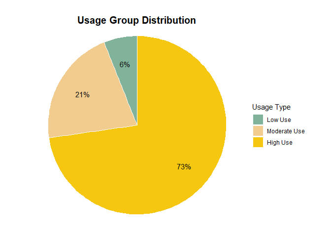<!-- -->

``` r
  options(repr.plot.width = 1, repr.plot.height = 1)
```

**Observations:**

-   **73%** of users who frequently used their devices between 22 - 31
    days. This makes up 24 out of 33 participants.

-   **12%** of users who moderately used their devices between 15 - 21
    days. This makes up 7 out of 33 participants.

-   **6%** of users who used their devices least frequently between 1-
    14 days. This makes up 2 out of 33 participants.

A large majority of users use the device frequently between 22-31 days.
I believe this reflects an innate understanding of the nature of use of
the device. That in order to receive the full utility and the insights
gained from it, the user has to wear it often to have a comprehensive
quantitative picture of their activity habits and physiological state.

### **2. Average Steps By Hour, Day & Usage Types**

Here, we will analyse the steps taken by users within and between
groups. While 10,000 daily steps have often been marked as the
recommended target, this had its roots from a marketing campaign for the
1964 Tokyo Olympic games. Recent
[studies](https://www.bbc.com/future/article/20190723-10000-steps-a-day-the-right-amount)
suggests that 5500 - 7500 steps would be a reasonable and achievable
target, depending on the users health and age range. The benefits of
walking more than 7500 steps are marginal and will plateau, unless the
intensity increases.

#### 2.1. Average Steps by Day

``` r
#data manipulation to add Usage Types to 'daily_activity' df
daily_activity_usage <- daily_activity %>% 
  left_join(daily_use2, by = 'id') %>% 
  mutate(day = format(ymd(date), format = '%a')) %>% 
  mutate(total_minutes_worn = sedentary_minutes+lightly_active_minutes+
           fairly_active_minutes+very_active_minutes) %>% 
  mutate(total_hours = seconds_to_period(total_minutes_worn * 60))
head(daily_activity_usage,6)
```

    ##           id       date total_steps total_distance tracker_distance
    ## 1 1503960366 2016-04-12       13162           8.50             8.50
    ## 2 1503960366 2016-04-13       10735           6.97             6.97
    ## 3 1503960366 2016-04-14       10460           6.74             6.74
    ## 4 1503960366 2016-04-15        9762           6.28             6.28
    ## 5 1503960366 2016-04-16       12669           8.16             8.16
    ## 6 1503960366 2016-04-17        9705           6.48             6.48
    ##   logged_activities_distance very_active_distance moderately_active_distance
    ## 1                          0                 1.88                       0.55
    ## 2                          0                 1.57                       0.69
    ## 3                          0                 2.44                       0.40
    ## 4                          0                 2.14                       1.26
    ## 5                          0                 2.71                       0.41
    ## 6                          0                 3.19                       0.78
    ##   light_active_distance sedentary_active_distance very_active_minutes
    ## 1                  6.06                         0                  25
    ## 2                  4.71                         0                  21
    ## 3                  3.91                         0                  30
    ## 4                  2.83                         0                  29
    ## 5                  5.04                         0                  36
    ## 6                  2.51                         0                  38
    ##   fairly_active_minutes lightly_active_minutes sedentary_minutes calories
    ## 1                    13                    328               728     1985
    ## 2                    19                    217               776     1797
    ## 3                    11                    181              1218     1776
    ## 4                    34                    209               726     1745
    ## 5                    10                    221               773     1863
    ## 6                    20                    164               539     1728
    ##   days_used    usage day total_minutes_worn total_hours
    ## 1        30 High Use Tue               1094  18H 14M 0S
    ## 2        30 High Use Wed               1033  17H 13M 0S
    ## 3        30 High Use Thu               1440 1d 0H 0M 0S
    ## 4        30 High Use Fri                998  16H 38M 0S
    ## 5        30 High Use Sat               1040  17H 20M 0S
    ## 6        30 High Use Sun                761  12H 41M 0S

``` r
#data for steps 
steps_hour <- daily_activity_usage %>% 
  group_by(day) %>%   
  summarise(mean_steps = round(mean(total_steps))) %>%
 mutate(day = factor(day, level = c('Mon', 'Tue', 'Wed','Thu', 'Fri', 'Sat', 'Sun')))
head(steps_hour)
```

    ## # A tibble: 6 x 2
    ##   day   mean_steps
    ##   <fct>      <dbl>
    ## 1 Fri         7448
    ## 2 Mon         7781
    ## 3 Sat         8153
    ## 4 Sun         6933
    ## 5 Thu         7406
    ## 6 Tue         8125

``` r
#plot for avg steps by day 
ggplot(steps_hour, aes(x = day, y= mean_steps, fill = mean_steps)) +
    geom_col(color="black", size = 0.1) +  
 scale_fill_gradient(low = "#81B29A", high = "#E07A5F") + 
  scale_y_continuous(limits=c(0,10000), breaks=seq(0, 10000, by = 2000))+ 
labs(title= ("Average Steps"), subtitle = ('By Day'), x="" , y="Calories")+
theme(plot.title=element_text(size = 14, hjust = 0, face = "bold"))+
    theme(plot.subtitle=element_text(size = 12,hjust = 0))+
    theme(axis.text.y=element_text(size=12)) +
    theme(axis.text.x=element_text(size=12,hjust= 0.5))+
    theme(axis.title.x = element_text(margin = margin(t = 14, r = 0, b = 0, l = 0)))+
    theme(axis.title.y = element_text(margin = margin(t = 0, r = 10, b = 0, l = 0)))+
    theme(legend.position = "top")+
    theme(legend.title=element_text(size=12))+
    theme(legend.text=element_text(size=8))+
guides(fill = guide_colourbar(barwidth = 12))
```

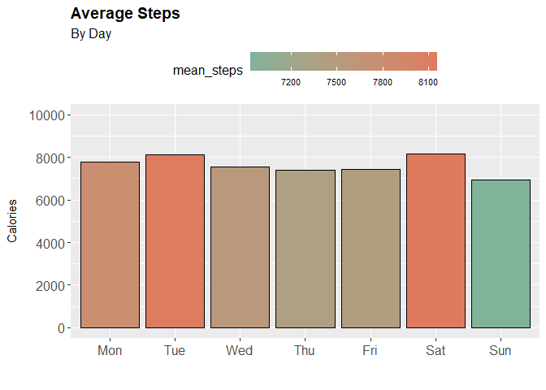<!-- -->

``` r
options(repr.plot.width = 10, repr.plot.height = 8)
```

**Observations:**

-   The highest step days are Saturday, followed by Tuesday and Monday.
    Trailing off over the rest of the weekdays.

-   Unsurprisingly Sunday is the lowest, a rest day.

#### 2.2. Average Steps by Usage

``` r
stepsbp <- daily_activity_usage %>% 
group_by(day,usage) %>%
select(usage, total_steps, day) %>%
    mutate(day = factor(day, level = c('Mon', 'Tue', 'Wed','Thu', 'Fri', 'Sat', 'Sun')))
head(stepsbp)
```

    ## # A tibble: 6 x 3
    ## # Groups:   day, usage [6]
    ##   usage    total_steps day  
    ##   <fct>          <int> <fct>
    ## 1 High Use       13162 Tue  
    ## 2 High Use       10735 Wed  
    ## 3 High Use       10460 Thu  
    ## 4 High Use        9762 Fri  
    ## 5 High Use       12669 Sat  
    ## 6 High Use        9705 Sun

``` r
#boxplot for distance
stepsbp %>%
  ggplot(aes(x= , y= total_steps, fill= usage)) +
    geom_boxplot() +
    scale_y_continuous(limits=c(0,40000), breaks=seq(0,40000, by = 5000))+
    theme(legend.position="none",
      plot.title = element_text(size=11)    ) +
    scale_fill_brewer(palette = "Set2") +
    ggtitle("A boxplot with jitter") +
    xlab("") +
    labs(title= ("Average Steps"), subtitle = ('By Usage Group'), x=" " , y="Calories")+
theme(plot.title=element_text(size = 14,hjust = 0, face = "bold"))+
    theme(plot.subtitle=element_text(size = 12,hjust = 0))+
    theme(axis.text.y=element_text(size=12)) +
    theme(axis.text.x=element_text(size=12,hjust= 0.5))+
    theme(axis.title.x = element_text(margin = margin(t = 14, r = 0, b = 0, l = 0)))+
    theme(axis.title.y = element_text(margin = margin(t = 0, r = 10, b = 0, l = 0)))+
    theme(axis.text.x=element_blank(),axis.ticks.x=element_blank())+
    theme(legend.position = "top")+
    theme(legend.title=element_text(size=12))+
    theme(legend.text=element_text(size=8))+
facet_grid(~usage)
```

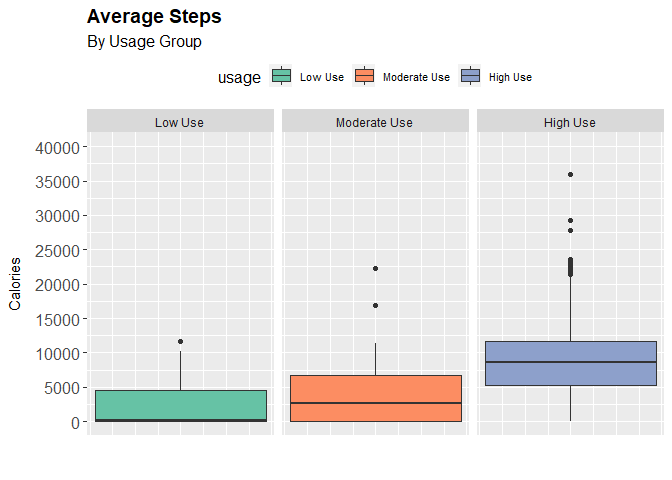<!-- -->

``` r
options(repr.plot.width = 5, repr.plot.height = 6)
```

#### 2.3. Average Steps by Day, Usage

``` r
#data for steps boxplot
stepsbp2 <- daily_activity_usage %>% 
group_by(day,usage) %>%
select(usage, total_steps) %>%
    mutate(day = factor(day, level = c('Mon', 'Tue', 'Wed','Thu', 'Fri', 'Sat', 'Sun')))
```

    ## Adding missing grouping variables: `day`

``` r
head(stepsbp2)
```

    ## # A tibble: 6 x 3
    ## # Groups:   day, usage [6]
    ##   day   usage    total_steps
    ##   <fct> <fct>          <int>
    ## 1 Tue   High Use       13162
    ## 2 Wed   High Use       10735
    ## 3 Thu   High Use       10460
    ## 4 Fri   High Use        9762
    ## 5 Sat   High Use       12669
    ## 6 Sun   High Use        9705

``` r
#boxplot for distance
  ggplot(stepsbp2, aes(x= day , y= total_steps, fill= usage)) +
    geom_boxplot() +
    scale_y_continuous(limits=c(0,30000), breaks=seq(0,30000, by = 2500))+
    scale_fill_brewer(palette = "Set2")+
    theme(legend.position="none",
      plot.title = element_text(size=11)) +
    ggtitle("A boxplot with jitter") +
    xlab("") +
    labs(title= ("Average Steps"), subtitle = ('By Usage Group'), x="Day" , y="Steps")+
theme(plot.title=element_text(size = 14,hjust = 0, face = "bold"))+
    theme(plot.subtitle=element_text(size = 10,hjust = 0))+
    theme(axis.text.y=element_text(size=8)) +
    theme(axis.text.x=element_text(size=8,hjust= 0.5))+
    theme(axis.title.x = element_text(margin = margin(t = 14, r = 0, b = 0, l = 0)))+
    theme(axis.title.y = element_text(margin = margin(t = 0, r = 10, b = 0, l = 0)))+   
    theme(legend.title=element_text(size=12))+
    theme(legend.text=element_text(size=8))+
facet_grid(~usage)
```

    ## Warning: Removed 1 rows containing non-finite values (stat_boxplot).

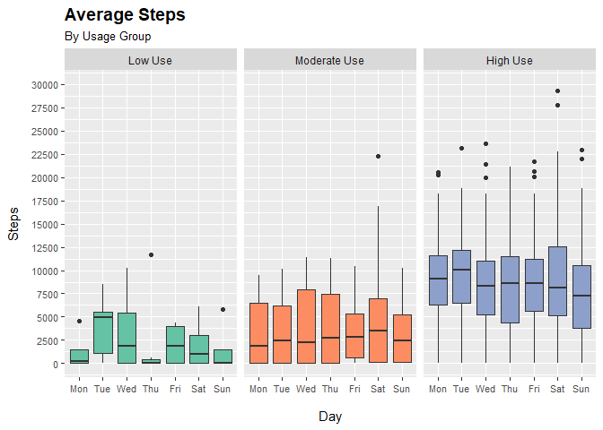<!-- -->

**Observations:**

-   The ‘High Use’ group in general have a higher median step range
    compared to the upper quartile of moderate users. They also have a
    wider range of steps each day of the week, displaying high
    variability of activities between users in this group.

-   The ’ Moderate Use’ group shows consistency in their daily average
    steps, displaying a slight rise through the weekdays. Wednesdays are
    the most active day during weekdays. Saturdays have the highest
    median steps as well, and also the highest Q4 of this group.

#### **2.4. Average Steps by Day, Usage, Time**

After obtaining the Usage Group Distribution, we are able to breakdown
the analysis of average steps further into the different Groups. Here we
are able to observe to some extent the differences in daily activity and
habits of each group.

*However, it is important to note that the ‘Low Use’ group has only 2
participants, therefore insights gained are limited as it does not
follow a normalized distribution within this sub-group.*

``` r
#data transformation to assign Usage Type to IDs on the hourly_cal_intensities_steps
step_hourly <- hourly_cal_intensities_steps %>%
  left_join(daily_use2, by = 'id','usage') %>% 
  mutate(day = factor(day,level = c('Mon', 'Tue', 'Wed','Thu', 'Fri', 'Sat', 'Sun'))) %>% 
  group_by(usage, time, day) %>% 
  summarise(steps = round(mean(step_total),2))
```

    ## `summarise()` has grouped output by 'usage', 'time'. You can override using the
    ## `.groups` argument.

``` r
head(step_hourly,3)
```

    ## # A tibble: 3 x 4
    ## # Groups:   usage, time [1]
    ##   usage   time  day   steps
    ##   <fct>   <chr> <fct> <dbl>
    ## 1 Low Use 00:00 Mon    0   
    ## 2 Low Use 00:00 Tue    1.17
    ## 3 Low Use 00:00 Wed    0

\`\`\`{#plotting heatmap of average hourly steps by DAY and USAGE
GROUPS} ggarrange( ggplot(step_hourly, aes(x = time,y = day)) +
geom_tile(aes(fill = steps)) + scale_fill_viridis(name=“Hourly
Steps”,option =“D”) + geom_text(aes(label = round(steps, digits = 0)),
color = “black”, size = 2.6) + theme_minimal(base_size = 14) +
labs(title= (“Average Hourly Steps”), subtitle = (‘By Day, Usage,
Time’), x=‘Time’, y=‘Day’)+ theme(plot.title=element_text(size = 14))+
theme(plot.subtitle=element_text(size = 10)) +
theme(axis.text.y=element_text(size=9)) +
theme(axis.text.x=element_text(size=9,hjust= 0.5))+ theme(axis.title.x =
element_text(margin = margin(t = 10, r = 0, b = 0, l = 0)))+
theme(axis.title.y = element_text(margin = margin(t = 0, r = 10, b = 0,
l = 0)))+ theme(legend.title=element_text(size=10))+
theme(legend.text=element_text(size=8)) + guides(fill =
guide_colourbar(barwidth = 0.45,barheight = 8))+ facet_wrap(\~usage,
ncol = 1),

ggplot(stephr, aes(x=time, y=steps, fill = steps))+
scale_fill_gradient(low = “green”, high = “red”)+ geom_bar(stat =
‘identity’, show.legend = TRUE) + coord_flip() + ggtitle(“Average Steps
By Hour”, “By Day, Time, Usage Groups”) + xlab(“Hour”) + ylab(“Steps”) +
theme(axis.text.x = element_text(size=8), axis.text.y =
element_text(size=5))+ theme(legend.position = “top”)+
facet_grid(usage\~day), ncol = 1) options(repr.plot.width = 12,
repr.plot.height = 16)


    **Observations:**

    -   Average hourly steps increases as usage of devices increases across
        Usage Groups.

    -   'High Use' group start their day an hour earlier (6:00AM) compared
        to other groups. Maintaining a higher average hourly step across all
        days of the week. Peaks in steps taken are consistently high between
        5:00 - 8:00PM, suggesting habitual excercise as work ends.

    -   'Moderate Use' group display peaks in their steps between 11:00AM -
        12:00PM, and a rise between 6:00PM - 7:00PM.

    -   'Low Use' group does not seem to display any symmetrical
        distribution of steps on any day of the week. This could be
        attributed to data gaps due to infrequent use.

    -   Saturday is the most active day across all Usage Groups.

    ### **3. Average CaloriesM Burnt**

    #### 3.1. Calories By Day


    ```r
    #data for calories burnt 
    calories <- daily_activity_usage %>% 
      group_by(day) %>%   
      summarise(mean_calories = round(mean(calories))) %>%
     mutate(day = factor(day, level = c('Mon', 'Tue', 'Wed','Thu', 'Fri', 'Sat', 'Sun')))

    head(calories)

    ## # A tibble: 6 x 2
    ##   day   mean_calories
    ##   <fct>         <dbl>
    ## 1 Fri            2332
    ## 2 Mon            2324
    ## 3 Sat            2355
    ## 4 Sun            2263
    ## 5 Thu            2200
    ## 6 Tue            2356

``` r
ggplot(calories, aes(x = day, y= mean_calories, fill = mean_calories)) +
    geom_col(color="#3D405B", size = 0.1) +  
  scale_fill_gradientn(limits=c(0,2700), breaks=seq(0,2700, by = 500), colours = brewer.pal(5, "Set2")) + 
  scale_y_continuous(limits=c(0,2800), breaks=seq(0,2800, by = 250))+
labs(title= ("Average Calories Burnt"), subtitle = ('By Days'), x="Days" , y="Calories")+
theme(plot.title=element_text(size = 16,hjust = 0))+
    theme(plot.subtitle=element_text(size = 14,hjust = 0))+
    theme(axis.text.y=element_text(size=14)) +
    theme(axis.text.x=element_text(size=14,hjust= 0.5))+
    theme(axis.title.x = element_text(margin = margin(t = 14, r = 0, b = 0, l = 0)))+
    theme(axis.title.y = element_text(margin = margin(t = 0, r = 10, b = 0, l = 0)))+
    theme(legend.position = "top")+
    theme(legend.title=element_text(size=12))+
    theme(legend.text=element_text(size=8))+
guides(fill = guide_colourbar(barwidth = 12))
```

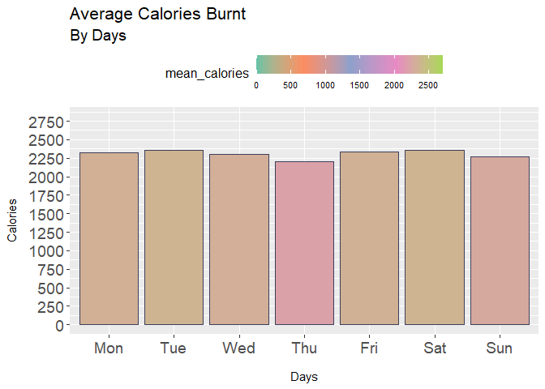<!-- -->

``` r
options(repr.plot.width = 10, repr.plot.height = 8)
```

#### **3.2. Calories By Groups**

``` r
caloriesbp <- daily_activity_usage %>% 
group_by(day,usage) %>%
select(usage, calories, day) %>%
    mutate(day = factor(day, level = c('Mon', 'Tue', 'Wed','Thu', 'Fri', 'Sat', 'Sun')))
head(caloriesbp)
```

    ## # A tibble: 6 x 3
    ## # Groups:   day, usage [6]
    ##   usage    calories day  
    ##   <fct>       <int> <fct>
    ## 1 High Use     1985 Tue  
    ## 2 High Use     1797 Wed  
    ## 3 High Use     1776 Thu  
    ## 4 High Use     1745 Fri  
    ## 5 High Use     1863 Sat  
    ## 6 High Use     1728 Sun

``` r
#boxplot for steps by usage
caloriesbp %>%
  ggplot(aes(x= , y= calories, fill= usage)) +
    geom_boxplot() +
    scale_y_continuous(limits=c(0,5000), breaks=seq(0,5000, by = 500))+
    theme(legend.position="none",
      plot.title = element_text(size=11)    ) +
    scale_fill_brewer(palette = "Set2") +
    ggtitle("A boxplot with jitter") +
    xlab("") +
    labs(title= ("Average Calories"), subtitle = ('By Usage Group'), x=" " , y="Calories")+
theme(plot.title=element_text(size = 14,hjust = 0, face = "bold"))+
    theme(plot.subtitle=element_text(size = 12,hjust = 0))+
    theme(axis.text.y=element_text(size=12)) +
    theme(axis.text.x=element_text(size=12,hjust= 0.5))+
    theme(axis.title.x = element_text(margin = margin(t = 14, r = 0, b = 0, l = 0)))+
    theme(axis.title.y = element_text(margin = margin(t = 0, r = 10, b = 0, l = 0)))+
    theme(axis.text.x=element_blank(),axis.ticks.x=element_blank())+
    theme(legend.position = "top")+
    theme(legend.title=element_text(size=12))+
    theme(legend.text=element_text(size=8))+
facet_grid(~usage)
```

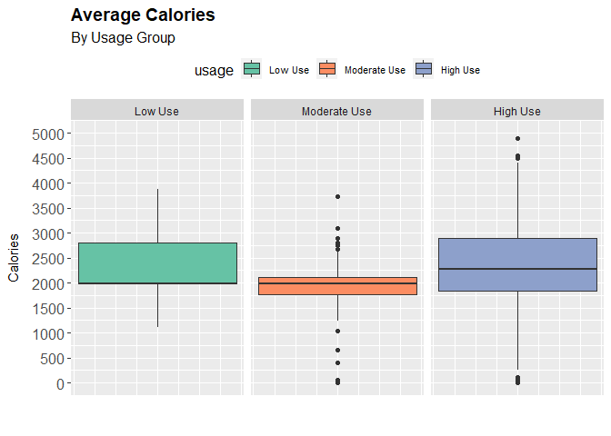<!-- -->

``` r
options(repr.plot.width = 5, repr.plot.height = 6)
```

**Observations:**

-   The ‘High Use’ group has a the highest median calories burnt as well
    as a significant higher Q3 group with slightly under 3000 calories
    burnt. The wider upper whisker of this group display a wide
    variance. Again, an indicator of the wide range of
    activities/excercise users in this group partake in. That users in
    this group are generally active, but some are partaking in very
    intensity physical activities.

#### **3.3. Calories By Day, Groups**

``` r
#boxplot for distance
  ggplot(caloriesbp, aes(x= day , y= calories, fill= usage)) +
    geom_boxplot() +
    theme(legend.position="none",
      plot.title = element_text(size=11)    ) +
    ggtitle("A boxplot with jitter") +
    scale_fill_brewer(palette = "Set2") +
    xlab("") +
    labs(title= ("Average Calories"), subtitle = ('By Usage Group'), x="Day" , y="Calories")+
theme(plot.title=element_text(size = 14,hjust = 0, face = "bold"))+
    theme(plot.subtitle=element_text(size = 12,hjust = 0))+
    theme(axis.text.y=element_text(size=12)) +
    theme(axis.text.x=element_text(size=12,hjust= 0.5))+
    theme(axis.title.x = element_text(margin = margin(t = 14, r = 0, b = 0, l = 0)))+
    theme(axis.title.y = element_text(margin = margin(t = 0, r = 10, b = 0, l = 0)))+
    theme(legend.position = "top")+
    theme(legend.title=element_text(size=12))+
    theme(legend.text=element_text(size=8))+
facet_grid(~usage)
```

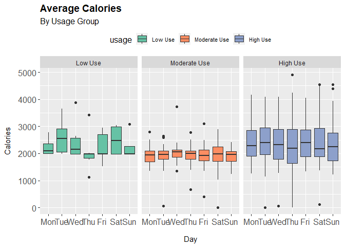<!-- -->

**Observations:**

-   The ‘High Use’ group in general have a higher median calorie range
    compared to the upper quartil of moderate users. They also have a
    wider range the calories burnt each day of the week, displaying high
    variability of activities between users in this group. They are also
    much more consistent in carrying out physical activities throughout
    the week. No showing a bias on which days to be active.

-   The ’ Moderate Use’ group shows consistency in their daily average
    calorie burn. Saturdays are the most active day during week,
    displaying a preference to be active on this day.

#### **3.4. Calories By Day, Groups, Time**

``` r
#data transformation to assign Usage Type to IDs on the hourly_cal_intensities_steps
hourlies_cal_usage <- hourly_cal_intensities_steps %>%
  left_join(daily_use2, by = 'id','usage') %>% 
  mutate(day = factor(day,level = c('Mon', 'Tue', 'Wed','Thu', 'Fri', 'Sat', 'Sun'))) %>% 
  group_by(usage, time, day) %>% 
  summarise(calories = round(mean(calories),2))
```

    ## `summarise()` has grouped output by 'usage', 'time'. You can override using the
    ## `.groups` argument.

``` r
head(hourlies_cal_usage,3)
```

    ## # A tibble: 3 x 4
    ## # Groups:   usage, time [1]
    ##   usage   time  day   calories
    ##   <fct>   <chr> <fct>    <dbl>
    ## 1 Low Use 00:00 Mon       83  
    ## 2 Low Use 00:00 Tue       81.8
    ## 3 Low Use 00:00 Wed       81.7

``` r
#plotting heatmap of average hourly steps by DAY and USAGE GROUPS
ggarrange(
ggplot(hourlies_cal_usage, aes(x = time,y = day)) + 
geom_tile(aes(fill = calories)) + 
scale_fill_viridis(name="Hourly Calories",option ="H") + 
geom_text(aes(label = round(calories, digits = 0)), color = "black", size = 2.6) +
theme_minimal(base_size = 14) +
labs(title= ("Average Hourly Calories"), subtitle = ('By Usage Groups'), x='Time', y='Day')+
    theme(plot.title=element_text(size = 14))+
    theme(plot.subtitle=element_text(size = 10)) +
    theme(axis.text.y=element_text(size=9)) +
    theme(axis.text.x=element_text(size=9,hjust= 0.5))+
    theme(axis.title.x = element_text(margin = margin(t = 10, r = 0, b = 0, l = 0)))+
    theme(axis.title.y = element_text(margin = margin(t = 0, r = 10, b = 0, l = 0)))+
    theme(legend.title=element_text(size=10))+
    theme(legend.text=element_text(size=8)) +
guides(fill = guide_colourbar(barwidth = 0.45,barheight = 8))+
facet_wrap(~usage, ncol = 1),
    
ggplot(hourlies_cal_usage, aes(x=time, y=calories, fill = calories))+ 
  scale_fill_gradient(low = "green", high = "red")+
  geom_bar(stat = 'identity', show.legend = TRUE) +
  coord_flip() +
  ggtitle("Average Hourly Calories", "By Day, Time, Usage Groups") +
      xlab("Hour") + ylab("Steps") +
      theme(axis.text.x = element_text(size=8), axis.text.y = element_text(size=5))+
      theme(legend.position = "top")+
  facet_grid(usage~day), ncol = 1)
```

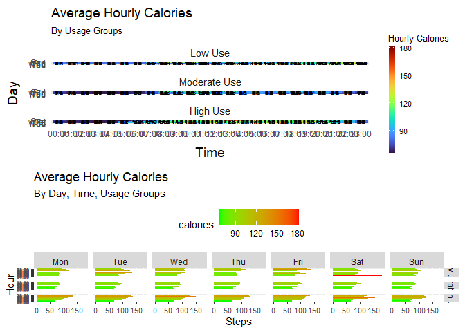<!-- -->

``` r
options(repr.plot.width = 12, repr.plot.height = 16)
```

### **4. Average Hourly Intensity By Day, Hour, & Usage Type**

#### **4.1. Intensity By Day**

**Observations:**

-   Saturdays are the peaks in intensity minutes, then it tapers off
    until Monday.

-   Wednesdays displays the lowest during the week. Very likely the need
    for rest and recalibration after a busy start to the work week.

#### **4.2. Intensity By Day, Groups**

``` r
intensityhr2 <- hourly_cal_intensities_steps %>%
  left_join(daily_use2, by = 'id') %>% 
  mutate(day = factor(day,level = c('Mon', 'Tue', 'Wed','Thu', 'Fri', 'Sat', 'Sun'))) %>% 
  filter(total_intensity > 0) %>%
  group_by(usage, day) %>% 
  summarise(intensity = round(mean(total_intensity),1))
```

    ## `summarise()` has grouped output by 'usage'. You can override using the
    ## `.groups` argument.

``` r
head(intensityhr2)
```

    ## # A tibble: 6 x 3
    ## # Groups:   usage [1]
    ##   usage   day   intensity
    ##   <fct>   <fct>     <dbl>
    ## 1 Low Use Mon        16.5
    ## 2 Low Use Tue        13.3
    ## 3 Low Use Wed        20.3
    ## 4 Low Use Thu        24  
    ## 5 Low Use Fri        16.6
    ## 6 Low Use Sat        21.6

``` r
ggplot(intensityhr2, aes(x = day, y= intensity, fill = intensity)) +
    geom_col(color="pink", size = 0.1)+
    scale_fill_gradientn(limits=c(0,25), breaks=seq(0,25, by = 5), colours = brewer.pal(5, "YlOrRd")) + 
    scale_y_continuous(limits=c(0,25), breaks=seq(0,25, by = 5))+
    labs(title= ("Average Intensity"), subtitle = ('By Days, Groups'), x="Days" , y="Intensity")+
    theme(plot.title=element_text(size = 16,hjust = 0))+
    theme(plot.subtitle=element_text(size = 14,hjust = 0))+
    theme(axis.text.y=element_text(size=14)) +
    theme(axis.text.x=element_text(size=14,hjust= 0.5))+
    theme(axis.title.x = element_text(margin = margin(t = 14, r = 0, b = 0, l = 0)))+
    theme(axis.title.y = element_text(margin = margin(t = 0, r = 10, b = 0, l = 0)))+
    theme(legend.position = "top")+
    theme(legend.title=element_text(size=12))+
    theme(legend.text=element_text(size=8))+
guides(fill = guide_colourbar(barwidth = 12))+
facet_grid(~usage)
```

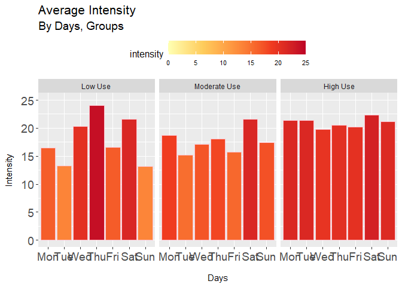<!-- -->

**Observations:**

-   Both the ‘High Use’ and ‘Moderate Use’ groups display peaks in their
    intensity on Saturdays. Using their free time on the weekends to
    participate in physical activities.

-   The ‘High Use’ group are consistently active throughout the week.
    Sundays are just as active despite being a day of rest. Consistent
    with previous trends, Wednesdays are the least intensive days,
    however still much more intensive when compared to other groups.

-   The ‘Low Use’ group does not show any discernible pattern of
    consistent intensity of activities.

#### **4.3. Intensity By Day, Groups, Time**

``` r
intensityhr <- hourly_cal_intensities_steps %>%
  left_join(daily_use2, by = 'id') %>% 
  mutate(day = factor(day,level = c('Mon', 'Tue', 'Wed','Thu', 'Fri', 'Sat', 'Sun'))) %>% 
  group_by(usage, time, day) %>% 
  summarise(intensity = round(mean(total_intensity),2))
```

    ## `summarise()` has grouped output by 'usage', 'time'. You can override using the
    ## `.groups` argument.

``` r
head(intensityhr)
```

    ## # A tibble: 6 x 4
    ## # Groups:   usage, time [1]
    ##   usage   time  day   intensity
    ##   <fct>   <chr> <fct>     <dbl>
    ## 1 Low Use 00:00 Mon        0   
    ## 2 Low Use 00:00 Tue        0.17
    ## 3 Low Use 00:00 Wed        0   
    ## 4 Low Use 00:00 Thu        1.17
    ## 5 Low Use 00:00 Fri        0.6 
    ## 6 Low Use 00:00 Sat        1.25

``` r
ggarrange(

ggplot(intensityhr, aes(x = time,y = day)) + 
  geom_tile(aes(fill = intensity)) + 
  scale_fill_viridis(name="Hourly Intensity",option ="H") + 
  geom_text(aes(label = intensity), color = "black", size = 2.5) +
  theme_minimal(base_size = 12) +
  labs(title= ("Average Hourly Intensity"), x='Time', y='Day', 
       caption = "")+
      theme(plot.title=element_text(size = 14,hjust = 0.5))+
      theme(axis.text.y=element_text(size=9)) +
      theme(axis.text.x=element_text(size=8, angle = 0,hjust= 0.5))+
      theme(axis.title.x = element_text(margin = margin(t = 10, r = 0, b = 0, l = 0)))+
      theme(axis.title.y = element_text(margin = margin(t = 0, r = 10, b = 0, l = 0)))+
      theme(legend.title=element_text(size=10))+
      theme(legend.text=element_text(size=8)) +
  guides(fill = guide_colourbar(barwidth = 0.45,barheight = 8))+
  facet_wrap (~usage, ncol = 1 ),
    
    ##step avg intensity
 ggplot(intensityhr, aes(x=time, y=intensity, fill = intensity))+ 
  scale_fill_gradient(low = "green", high = "red")+
  geom_bar(stat = 'identity', show.legend = TRUE) +
  coord_flip() +
  ggtitle("Intensity By Hours", "All user groups") +
  xlab("Intensity") + ylab("Hour") +
  theme(axis.text.x = element_text(size=9, angle = 0), 
        axis.text.y = element_text(size=7))+
  theme(legend.position = "right")+
  guides(fill = guide_colourbar(barwidth = 0.45,barheight = 8))+
  facet_grid(usage~day), ncol = 1)
```

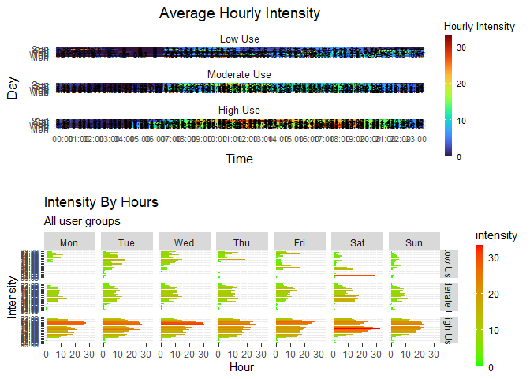<!-- -->

``` r
options(repr.plot.width = 12, repr.plot.height = 16)
```

**Observations:**

-   Similar to previous observations on steps taken, all user groups
    display higher intensity in the evenings.

-   ‘High Use’ participants tend to maintain a high average hourly
    intensity rate across all days of the week.

-   Compared to other groups, the ‘High Use’ participants are display
    higher intensities between 6:00AM - 7:00AM. We can assume that
    participants from this group are excercising before they start work.

-   Most notably, ‘High Use’ participants are taking signicantly more
    steps after office hours between 5:00PM - 8:00PM.

### **5. Average Distance by Day, Usage Type**

#### **5.1. Distance Travelled by Groups**

``` r
#data for distance 
distancebp <- daily_activity_usage %>% 
group_by(day,usage) %>%
select(day, usage, total_distance) %>%
    mutate(day = factor(day, level = c('Mon', 'Tue', 'Wed','Thu', 'Fri', 'Sat', 'Sun')))
head(distancebp)
```

    ## # A tibble: 6 x 3
    ## # Groups:   day, usage [6]
    ##   day   usage    total_distance
    ##   <fct> <fct>             <dbl>
    ## 1 Tue   High Use           8.5 
    ## 2 Wed   High Use           6.97
    ## 3 Thu   High Use           6.74
    ## 4 Fri   High Use           6.28
    ## 5 Sat   High Use           8.16
    ## 6 Sun   High Use           6.48

``` r
#boxplot for distance
ggplot(distancebp, aes(x= usage , y= total_distance, fill= usage)) +
    geom_boxplot() +
    scale_y_continuous(limits=c(0,30), breaks=seq(0,30, by = 2))+
    theme(legend.position="none",
      plot.title = element_text(size=11)) +
    ggtitle("A boxplot with jitter") +
    xlab("") +
    labs(title= ("Average Distance"), subtitle = ('By Usage Group'), x="Day" , y="Distance")+
theme(plot.title=element_text(size = 16,hjust = 0))+
    theme(plot.subtitle=element_text(size = 14,hjust = 0))+
    theme(axis.text.y=element_text(size=14)) +
    theme(axis.text.x=element_text(size=14,hjust= 0.5))+
    theme(axis.title.x = element_text(margin = margin(t = 14, r = 0, b = 0, l = 0)))+
    theme(axis.title.y = element_text(margin = margin(t = 0, r = 10, b = 0, l = 0)))+
    theme(legend.position = "top")+
    theme(legend.title=element_text(size=12))+
    theme(legend.text=element_text(size=8))
```

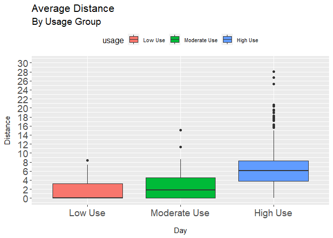<!-- -->

``` r
options(repr.plot.width = 5, repr.plot.height = 6)
```

#### **5.2. Distance Travelled by Day, Groups**

``` r
#data for distance 
distancebp <- daily_activity_usage %>% 
group_by(day,usage) %>%
select(day, usage, total_distance) %>%
    mutate(day = factor(day, level = c('Mon', 'Tue', 'Wed','Thu', 'Fri', 'Sat', 'Sun')))
head(distancebp)
```

    ## # A tibble: 6 x 3
    ## # Groups:   day, usage [6]
    ##   day   usage    total_distance
    ##   <fct> <fct>             <dbl>
    ## 1 Tue   High Use           8.5 
    ## 2 Wed   High Use           6.97
    ## 3 Thu   High Use           6.74
    ## 4 Fri   High Use           6.28
    ## 5 Sat   High Use           8.16
    ## 6 Sun   High Use           6.48

``` r
#boxplot for distance
  ggplot(distancebp, aes(x= day, y= total_distance, fill= usage)) +
    geom_boxplot() +
    scale_y_continuous(limits=c(0,30), breaks=seq(0,30, by = 2))+
    theme(legend.position="none",
      plot.title = element_text(size=11)    ) +
    ggtitle("A boxplot with jitter") +
    xlab("") +
    labs(title= ("Average Distance"), subtitle = ('By Usage Group'), x="Day" , y="Distance")+
theme(plot.title=element_text(size = 16,hjust = 0))+
    theme(plot.subtitle=element_text(size = 14,hjust = 0))+
    theme(axis.text.y=element_text(size=14)) +
    theme(axis.text.x=element_text(size=14,hjust= 0.5))+
    theme(axis.title.x = element_text(margin = margin(t = 14, r = 0, b = 0, l = 0)))+
    theme(axis.title.y = element_text(margin = margin(t = 0, r = 10, b = 0, l = 0)))+
    theme(legend.position = "top")+
    theme(legend.title=element_text(size=12))+
    theme(legend.text=element_text(size=8))+
facet_grid(~usage)
```

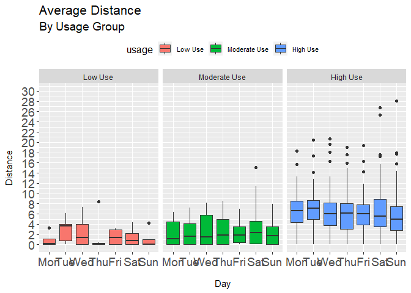<!-- -->

``` r
options(repr.plot.width = 12, repr.plot.height = 8)
```

**Observations:**

-   The ‘High Use’ group have the highest median distance travelled in a
    day together with a wide spread. Again, displaying that each user in
    this group are active but varied in their physical activities. We
    can see extreme outliers travelling 26-30km on Saturday and Sunday,
    very likely running marathons. And another grouping between 14-20km,
    most likely long runs.

-   The ‘Moderate Use’ group are also consistent in their daily distance
    travelled although noticeably lower than the ‘Higher Use’ group.
    Once again, Wednesdays are the most active weekday, and Saturdays
    are the most active out of all the week.

-   The ‘Low Use’ group does not display any habitual patterns of
    activity.

### **6. Activity Minutes Comparison**

Here, we will analyse how activity minutes and pattern differs across
the different Usage Groups. This dataset designates every non-sleeping
minute of the day into four different intensities - Sedentary Minutes,
Lightly Active Minutes, Fairly Active Minutes and Very Active Minutes.

These states of activity are based on their MET ratings. A MET is a
ratio of your working metabolic rate relative to your resting metabolic
rate. Metabolic rate is the rate of energy expended per unit of time.
It’s one way to describe the intensity of an exercise or activity.

One MET is the energy you spend sitting at rest — your resting or basal
metabolic rate. So, an activity with a MET value of 4 means you’re
exerting four times the energy than you would if you were sitting
still.To put it in perspective, a brisk walk at 3 or 4 miles per hour
has a value of 4 METs. Jumping rope, which is a more vigorous activity,
has a MET value of 12.3

-   Sedentary Minutes - \< 1.5 METs
-   Lightly Active Minutes - Between 1.5 - 3 METs
-   Fairly Active Minutes - Between 3 - 6 METs
-   Very Active Minutes - \> 6 METs

``` r
#data transformation to obtain total_minutes_worn
daily_activity_usage <- daily_activity %>% 
  left_join(daily_use2, by = 'id','date') %>% 
  mutate(day = format(ymd(date), format = '%a')) %>% 
  mutate(total_minutes_worn = sedentary_minutes+lightly_active_minutes+
           fairly_active_minutes+very_active_minutes) %>% 
  mutate(total_hours = seconds_to_period(total_minutes_worn * 60))
head(daily_activity_usage,3)
```

    ##           id       date total_steps total_distance tracker_distance
    ## 1 1503960366 2016-04-12       13162           8.50             8.50
    ## 2 1503960366 2016-04-13       10735           6.97             6.97
    ## 3 1503960366 2016-04-14       10460           6.74             6.74
    ##   logged_activities_distance very_active_distance moderately_active_distance
    ## 1                          0                 1.88                       0.55
    ## 2                          0                 1.57                       0.69
    ## 3                          0                 2.44                       0.40
    ##   light_active_distance sedentary_active_distance very_active_minutes
    ## 1                  6.06                         0                  25
    ## 2                  4.71                         0                  21
    ## 3                  3.91                         0                  30
    ##   fairly_active_minutes lightly_active_minutes sedentary_minutes calories
    ## 1                    13                    328               728     1985
    ## 2                    19                    217               776     1797
    ## 3                    11                    181              1218     1776
    ##   days_used    usage day total_minutes_worn total_hours
    ## 1        30 High Use Tue               1094  18H 14M 0S
    ## 2        30 High Use Wed               1033  17H 13M 0S
    ## 3        30 High Use Thu               1440 1d 0H 0M 0S

#### **6.1. All Activity Minutes Distribution**

Here, the daily_activity_usage is further manipulated to obtain how the
four states of activity differ across ‘Usage Groups’. I will create 4
different sets of data frames consisting of the activity minutes for the
‘High Use’,‘Moderate Use’,‘Low Use’ and ‘All’ groups. Each data frame
will create 4 separate pie charts showing how each ‘Usage Group’ spend a
portion of their day in each of the four states.

``` r
#data transformation to set up df for various piecharts
##overall activity minutes piechart
dailytypemins <- daily_activity %>% 
  select("date","sedentary_minutes","lightly_active_minutes","fairly_active_minutes","very_active_minutes") %>% 
  pivot_longer(cols =2:5, names_to="category",values_to='minutes') %>% 
  group_by(category) %>% 
  summarise(minutes = round(mean(minutes))) %>% 
  mutate(perc = minutes/sum(minutes)) %>% 
  arrange(perc) %>% 
  mutate(perc = scales::percent(perc)) %>% 
  mutate(category = factor(category,level = c('sedentary_minutes','active_minutes','lightly_active_minutes', 
  'fairly_active_minutes','very_active_minutes')))
head(dailytypemins,3)
```

    ## # A tibble: 3 x 3
    ##   category               minutes perc  
    ##   <fct>                    <dbl> <chr> 
    ## 1 fairly_active_minutes       14 1.15% 
    ## 2 very_active_minutes         21 1.72% 
    ## 3 lightly_active_minutes     193 15.83%

``` r
###high usage activity minutes piechart
dailytypeminshigh <- daily_activity_usage %>% 
  filter(usage == 'High Use') %>% 
  select("date","sedentary_minutes","lightly_active_minutes","fairly_active_minutes","very_active_minutes") %>% 
  pivot_longer(cols =2:5, names_to="category",values_to='minutes') %>% 
  group_by(category) %>% 
  summarise(minutes = round(mean(minutes))) %>% 
  mutate(perc = minutes/sum(minutes)) %>% 
  arrange(perc) %>% 
  mutate(perc = scales::percent(perc)) %>% 
  mutate(category = factor(category,level = c('sedentary_minutes','active_minutes','lightly_active_minutes', 
                                              'fairly_active_minutes','very_active_minutes')))
head(dailytypeminshigh,3)
```

    ## # A tibble: 3 x 3
    ##   category               minutes perc  
    ##   <fct>                    <dbl> <chr> 
    ## 1 fairly_active_minutes       15 1.26% 
    ## 2 very_active_minutes         25 2.09% 
    ## 3 lightly_active_minutes     214 17.92%

``` r
###moderate usage activity minutes piechart
dailytypeminsmod <- daily_activity_usage %>% 
  filter(usage == 'Moderate Use') %>% 
  select("date","sedentary_minutes","lightly_active_minutes","fairly_active_minutes","very_active_minutes") %>% 
  pivot_longer(cols =2:5, names_to="category",values_to='minutes') %>% 
  group_by(category) %>% 
  summarise(minutes = round(mean(minutes))) %>% 
  mutate(perc = minutes/sum(minutes)) %>% 
  arrange(perc) %>% 
  mutate(perc = scales::percent(perc)) %>% 
  mutate(category = factor(category,level = c('sedentary_minutes','active_minutes','lightly_active_minutes', 
                                              'fairly_active_minutes','very_active_minutes')))
head(dailytypeminsmod,3)
```

    ## # A tibble: 3 x 3
    ##   category               minutes perc 
    ##   <fct>                    <dbl> <chr>
    ## 1 fairly_active_minutes        7 0.5% 
    ## 2 very_active_minutes          7 0.5% 
    ## 3 lightly_active_minutes     125 9.7%

``` r
###low usage activity minutes piechart
dailytypeminslow <- daily_activity_usage %>% 
  filter(usage == 'Low Use') %>% 
  select("date","sedentary_minutes","lightly_active_minutes","fairly_active_minutes","very_active_minutes") %>% 
  pivot_longer(cols =2:5, names_to="category",values_to='minutes') %>% 
  group_by(category) %>% 
  summarise(minutes = round(mean(minutes))) %>% 
  mutate(perc = minutes/sum(minutes)) %>% 
  arrange(perc) %>% 
  mutate(perc = scales::percent(perc)) %>% 
  mutate(category = factor(category,level = c('sedentary_minutes','active_minutes','lightly_active_minutes', 
                                              'fairly_active_minutes','very_active_minutes'))) 

head(dailytypeminslow,3)
```

    ## # A tibble: 3 x 3
    ##   category               minutes perc 
    ##   <fct>                    <dbl> <chr>
    ## 1 fairly_active_minutes        5 0.4% 
    ## 2 very_active_minutes          5 0.4% 
    ## 3 lightly_active_minutes      80 6.0%

Make the joint of data visualizations:

``` r
ggarrange(
  ggplot(dailytypemins, aes(x="",y=minutes, fill=category)) +
    geom_bar(stat = "identity", width = 1)+
    coord_polar("y", start=0)+
    theme_minimal()+
    theme(axis.title.x= element_blank(),
          axis.title.y = element_blank(),
          panel.border = element_blank(), 
          panel.grid = element_blank(), 
          axis.ticks = element_blank(),
          axis.text.x = element_blank(),
          plot.title = element_text(hjust = 0.5, size=10, face = "bold"),
          plot.subtitle = element_text(hjust = 0.5)) +
      geom_text_repel(aes(x = 1.6, y = minutes, label = perc), 
                    nudge_x = .5, 
                    segment.size = .5, 
                    show.legend = FALSE)+
    labs(title="Daily Activity minutes Distribution", subtitle = "All Users"),
  ggarrange(
    ggplot(dailytypeminshigh, aes(x="",y=minutes, fill=category)) +
      geom_bar(stat = "identity", width = 1)+
      coord_polar("y", start=0)+
      theme_minimal()+
      theme(axis.title.x= element_blank(),
            axis.title.y = element_blank(),
            panel.border = element_blank(), 
            panel.grid = element_blank(), 
            axis.ticks = element_blank(),
            axis.text.x = element_blank(),
            plot.title = element_text(hjust = 0.5, size=10, face = "bold"),
            plot.subtitle = element_text(hjust = 0.5), 
            legend.position = "none")+
      geom_text_repel(aes(x = 1.6, y = minutes, label = perc), 
                      nudge_x = .3, 
                      segment.size = .3, 
                      show.legend = FALSE)+
      labs(title="", subtitle = "High Usage"), 
    ggplot(dailytypeminsmod, aes(x="",y=minutes, fill=category)) +
      geom_bar(stat = "identity", width = 1)+
      coord_polar("y", start=0)+
      theme_minimal()+
      theme(axis.title.x= element_blank(),
            axis.title.y = element_blank(),
            panel.border = element_blank(), 
            panel.grid = element_blank(), 
            axis.ticks = element_blank(),
            axis.text.x = element_blank(),
            plot.title = element_text(hjust = 0.5, size=10, face = "bold"), 
            plot.subtitle = element_text(hjust = 0.5),
            legend.position = "none") +
      geom_text_repel(aes(x = 1.6, y = minutes, label = perc), 
                      nudge_x = .3, 
                      segment.size = .3, 
                      show.legend = FALSE)+
      labs(title="", subtitle = "Moderate Usage"), 
    ggplot(dailytypeminslow, aes(x="",y=minutes, fill=category)) +
      geom_bar(stat = "identity", width = 1)+
      coord_polar("y", start=0)+
      theme_minimal()+
      theme(axis.title.x= element_blank(),
            axis.title.y = element_blank(),
            panel.border = element_blank(), 
            panel.grid = element_blank(), 
            axis.ticks = element_blank(),
            axis.text.x = element_blank(),
            plot.title = element_text(hjust = 0.5, size=10, face = "bold"), 
            plot.subtitle = element_text(hjust = 0.5),
            legend.position = "none") +
      geom_text_repel(aes(x = 1.6, y = minutes, label = perc), 
                      nudge_x = .3, 
                      segment.size = .3, 
                      show.legend = FALSE)+
      labs(title="", subtitle = "Low Usage"), 
    ncol = 3), 
  nrow = 2)
```

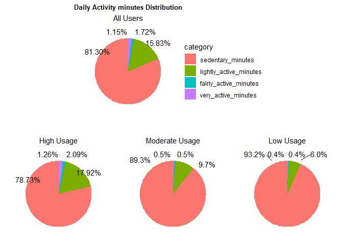<!-- -->

#### **6.2. Sedentary & Lightly Active Minutes**

``` r
#data for moderately_active & very_active minutes
active_minutes <- daily_activity_usage %>% 
  group_by(usage) %>% 
  summarise(very_active = mean(very_active_minutes),
            fairly_active = mean(fairly_active_minutes)) %>% 
  mutate(usage = factor(usage, level = c('High Use', 'Moderate Use', 'Low Use'))) %>% 
  pivot_longer(cols =2:3, names_to="category",values_to='minutes') 
head(active_minutes)
```

    ## # A tibble: 6 x 3
    ##   usage        category      minutes
    ##   <fct>        <chr>           <dbl>
    ## 1 Low Use      very_active      4.69
    ## 2 Low Use      fairly_active    4.91
    ## 3 Moderate Use very_active      6.75
    ## 4 Moderate Use fairly_active    7.41
    ## 5 High Use     very_active     25.4 
    ## 6 High Use     fairly_active   15.4

``` r
##data for sedentary & lightly_active minutes
light_minutes <- daily_activity_usage %>% 
  group_by(usage) %>% 
  summarise(lightly_active = mean(lightly_active_minutes)/60,
            sedentary = mean(sedentary_minutes)/60) %>% 
  mutate(usage = factor(usage, level = c('High Use', 'Moderate Use', 'Low Use'))) %>% 
  pivot_longer(cols =2:3, names_to="category",values_to='hours')
head(light_minutes)
```

    ## # A tibble: 6 x 3
    ##   usage        category       hours
    ##   <fct>        <chr>          <dbl>
    ## 1 Low Use      lightly_active  1.33
    ## 2 Low Use      sedentary      20.6 
    ## 3 Moderate Use lightly_active  2.09
    ## 4 Moderate Use sedentary      19.3 
    ## 5 High Use     lightly_active  3.57
    ## 6 High Use     sedentary      15.7

``` r
#comparison of sedentary minutes & lightly active minutes
ggarrange(
  ggplot(light_minutes, aes(fill=category, y= hours, x=usage)) + 
    geom_bar(position="stack", stat="identity")+
    scale_fill_manual(values = c("#00BFC4","#C77CFF"))+
    theme(axis.text.x = element_text(size = 11, angle = 0, hjust = 0.5, vjust = 1))+
    theme(legend.position = "top")+
    labs(x="" , y="Hours")+
    ggtitle("Comparison of Average Light Minutes", "By Usage Groups, Activity Levels"),
  
  ggplot(active_minutes, aes(fill=category, y= minutes, x=usage)) + 
  geom_bar(position="stack", stat="identity")+
  scale_fill_manual(values = c('#F8766D',"#7CAE00"))+
  theme(axis.text.x = element_text(size = 11, angle = 0, hjust = 0.5, vjust = 1))+
  theme(legend.position = "top")+
  labs(x="" , y="Minutes")+
  ggtitle("Comparison of Average Active Minutes", "By Usage Groups, Activity Levels"), ncol = 2
) 
```

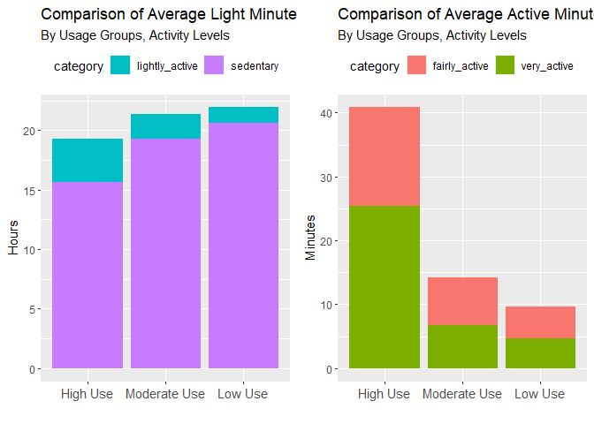<!-- -->

``` r
options(repr.plot.width = 14, repr.plot.height = 10)
```

**Observations:** - ‘High Use’ participants are exceptionally active,
with 40 mins of daily active minutes. Compared to 14 mins for ‘Moderate’
participants and 10 mins for ‘Low Use’ participants. - Likewise ‘High
Use’ participants are considerably less sedentary with 19 hours of light
minutes. Compared to approximately 21 hours for both ‘Moderate’ and ‘Low
Use’ participants.

#### **6.3. Fairly Active & Very Active Minutes by Day, Usage Groups**

``` r
#data for fairly_active & very_active minutes
active_minutes2 <- daily_activity_usage %>% 
  group_by(day, usage) %>%   
  summarise(fairly_active = mean(fairly_active_minutes),
            very_active = mean(very_active_minutes)) %>%  
  pivot_longer(cols =3:4, names_to="category",values_to='minutes') %>% 
  mutate(day = factor(day, level = c('Mon', 'Tue', 'Wed','Thu', 'Fri', 'Sat', 'Sun'))) 
```

    ## `summarise()` has grouped output by 'day'. You can override using the `.groups`
    ## argument.

``` r
head(active_minutes2)
```

    ## # A tibble: 6 x 4
    ## # Groups:   day [1]
    ##   day   usage        category      minutes
    ##   <fct> <fct>        <chr>           <dbl>
    ## 1 Fri   Low Use      fairly_active    4.8 
    ## 2 Fri   Low Use      very_active      7.8 
    ## 3 Fri   Moderate Use fairly_active    5.36
    ## 4 Fri   Moderate Use very_active      1.8 
    ## 5 Fri   High Use     fairly_active   14.2 
    ## 6 Fri   High Use     very_active     25.4

``` r
#comparison of active minutes between usage types

ggplot(active_minutes2,aes(day,minutes, fill = usage))+ 
  geom_col()+
  theme(axis.text.x = element_text(size = 11, angle = 60, hjust = 1, vjust = 1))+
  theme(legend.position = "top")+
  labs(x="Days" , y="Hours")+
  ggtitle("Comparison of Lightly Active Mins", "By Groups, Days and Levels") +
  facet_grid(category ~ usage)
```

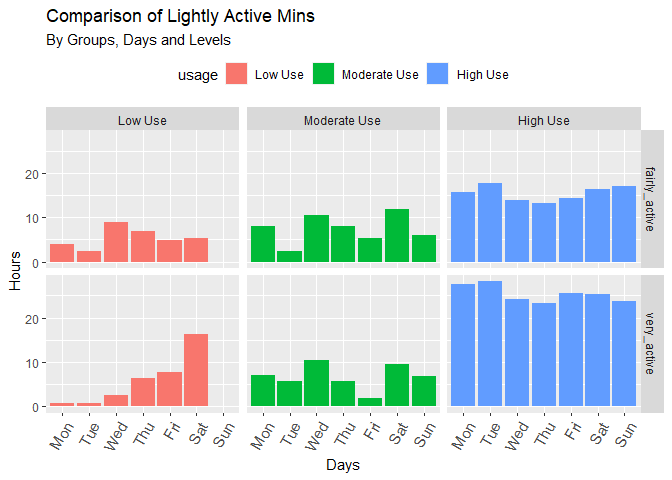<!-- -->

**Observations:** - ‘High Use’ participants display consistent patterns
of active minutes on each day of the week, more intense at the start of
the week (Mon - Tues). - ‘Low Use’ and ‘Moderate’ use participants do
not follow consistent patterns of active minutes. ‘Low Use’ participants
are hardly active on Sundays.

#### **6.4. Sedentary & Lightly Active Minutes by Day, Usage Groups**

``` r
#data for lightly_active minutes
lightly_active <- daily_activity_usage %>% 
  group_by(day, usage) %>%   
  summarise(lightly_active = mean(lightly_active_minutes)/60) %>% 
  pivot_longer(cols =3, names_to="category",values_to='minutes') %>% 
  mutate(day = factor(day, level = c('Mon', 'Tue', 'Wed','Thu', 'Fri', 'Sat', 'Sun')))
```

    ## `summarise()` has grouped output by 'day'. You can override using the `.groups`
    ## argument.

``` r
head(lightly_active,3)
```

    ## # A tibble: 3 x 4
    ## # Groups:   day [1]
    ##   day   usage        category       minutes
    ##   <fct> <fct>        <chr>            <dbl>
    ## 1 Fri   Low Use      lightly_active    1.17
    ## 2 Fri   Moderate Use lightly_active    2.31
    ## 3 Fri   High Use     lightly_active    3.80

``` r
#data for sedentary minutes
sedentary <- daily_activity_usage %>% 
  group_by(day, usage) %>%   
  summarise(sedentary = mean(sedentary_minutes)/60) %>% 
  pivot_longer(cols =3, names_to="category",values_to='minutes') %>% 
  mutate(day = factor(day, level = c('Mon', 'Tue', 'Wed','Thu', 'Fri', 'Sat', 'Sun'))) 
```

    ## `summarise()` has grouped output by 'day'. You can override using the `.groups`
    ## argument.

``` r
head(sedentary,3)
```

    ## # A tibble: 3 x 4
    ## # Groups:   day [1]
    ##   day   usage        category  minutes
    ##   <fct> <fct>        <chr>       <dbl>
    ## 1 Fri   Low Use      sedentary    19.7
    ## 2 Fri   Moderate Use sedentary    18.1
    ## 3 Fri   High Use     sedentary    16.1

``` r
#facet graphs sedentary & lightly active
ggarrange(
  ggplot(sedentary,aes(day,minutes, fill = usage))+ 
    geom_col()+
    theme(axis.text.x = element_text(size = 11, angle = 60, hjust = 1, vjust = 1))+
    theme(legend.position = "top")+
    labs(x="Days" , y="Hours")+
    ggtitle("Comparison of Sedentary Mins", "By Groups, Days and Levels") +
    facet_grid(category ~ usage),
  
  ggplot(lightly_active,aes(day,minutes, fill = usage))+ 
    geom_col()+
    theme(axis.text.x = element_text(size = 11, angle = 60, hjust = 1, vjust = 1))+
    theme(legend.position = " ")+
    labs(x="Days" , y="Hours")+
    ggtitle("Comparison of Lightly Active Mins", "By Groups, Days and Levels") +
    facet_grid(category ~ usage), ncol = 1
)
```

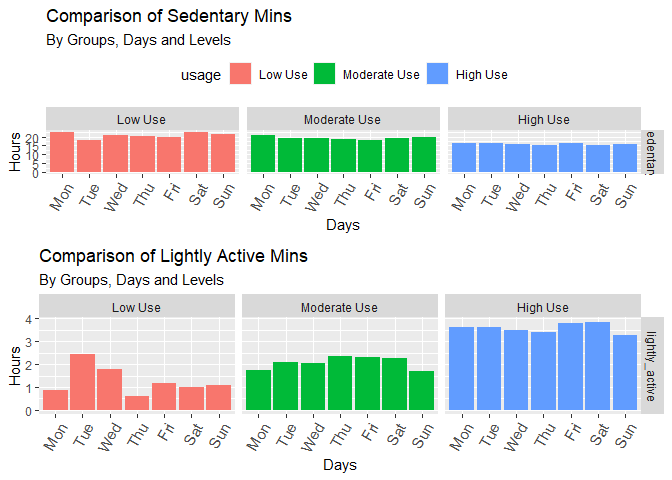<!-- -->

**Observations:**

-   ‘High Use’ participants are less sedentary on the weekends than they
    are on the weekdays.
-   ‘Low Use’ participants are the most sedentary of the Usage Groups

### **7. Correlations Analysis**

This set of plots would delve a step deeper than the above plot by
splitting the average steps taken/hour across the different user groups.

#### **7.1. Steps vs Calories Across Groups**

``` r
hourliesusage_df <- hourly_cal_intensities_steps %>% 
  rename(activity_date = date) %>% 
  left_join(daily_use2, by = 'id') %>% 
group_by(usage, id, activity_date) %>% 
  summarise(total_intensity = round(mean(total_intensity),0),
            step_total = round(mean(step_total),2),
            calories = round(mean(calories),0),.groups = "drop")
```

``` r
ggplot(hourliesusage_df, aes(x=step_total, y=calories, color = usage))+
  geom_jitter()+
  geom_smooth(method = 'loess', formulate = y ~ x)+
  stat_cor(aes(label = ..r.label..), label.x = 10)+
  labs(title = "Correlation of Steps and Calories", x = "Steps", y= "Calories") +
  theme(panel.background = element_blank(),
        plot.title = element_text( size=10))+
  facet_wrap(~usage)
```

    ## Warning: Ignoring unknown parameters: formulate

    ## `geom_smooth()` using formula 'y ~ x'

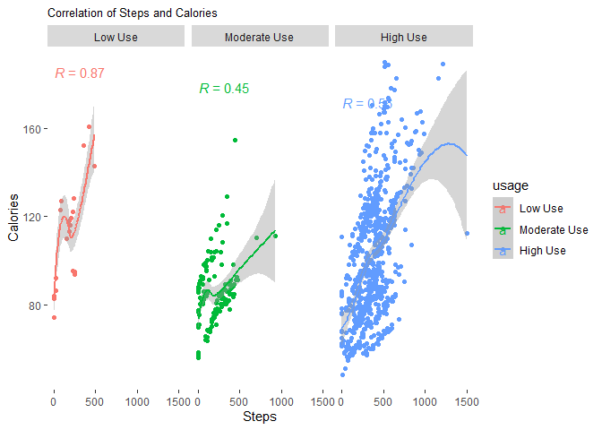<!-- -->

``` r
options(repr.plot.width = 14, repr.plot.height = 8)
```

#### **7.2. Intensity vs Calories Across Groups**

``` r
ggplot(hourliesusage_df, aes(x=total_intensity, y=calories, color = usage))+
  geom_jitter()+
  geom_smooth(method = 'loess', formulate = y ~ x)+
  stat_cor(aes(label = ..r.label..), label.x = 10)+
  labs(title = "Correlation of Intensity and Calories", x = "Intensity", y= "Calories") +
  theme(panel.background = element_blank(),
        plot.title = element_text( size=10))+
  facet_wrap(~usage)
```

    ## Warning: Ignoring unknown parameters: formulate

    ## `geom_smooth()` using formula 'y ~ x'

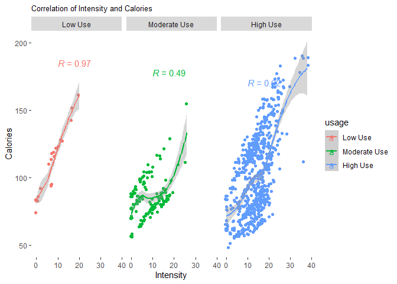<!-- -->

``` r
options(repr.plot.width = 14, repr.plot.height = 8)
```

**Observations for 7.1 & 7.2:** - ‘High Use’ and ‘Moderate Use’
participants display a moderately positive correlation of steps to
calories with Pearson Correlation coefficient of r = 0.56 and r = 0.45
respectively. - ‘Low Use’ participants display a strong positive
correlation, however it should be noted that it has a sample size of 2.

#### **7.3. Intensity vs Steps Across Groups**

``` r
#data for correlations
hourliesusage_df <- hourly_cal_intensities_steps %>% 
  rename(activity_date = date) %>% 
  left_join(daily_use2, by = 'id') %>% 
group_by(usage, id, activity_date) %>% 
  summarise(total_intensity = round(mean(total_intensity),0),
            step_total = round(mean(step_total),2),
            calories = round(mean(calories),0),.groups = "drop")

head(hourliesusage_df,3)
```

    ## # A tibble: 3 x 6
    ##   usage           id activity_date       total_intensity step_total calories
    ##   <fct>        <dbl> <dttm>                        <dbl>      <dbl>    <dbl>
    ## 1 Low Use 4020332650 2016-04-12 00:00:00              16     354.        152
    ## 2 Low Use 4020332650 2016-04-13 00:00:00               0       0          83
    ## 3 Low Use 4020332650 2016-04-14 00:00:00               0       1.58       84

``` r
#correlations intensity v steps between user groups //
ggplot(hourliesusage_df, aes(x=total_intensity, y=step_total, color = usage))+
  geom_jitter()+
  geom_smooth(method = 'loess', formulate = y ~ x)+
  stat_cor(aes(label = ..r.label..), label.x = 10)+
  labs(title = "Correlation of Intensity and Steps", x = "Steps", y= "Calories") +
  theme(panel.background = element_blank(),
        plot.title = element_text( size=10))+
  facet_wrap(~usage)
```

    ## Warning: Ignoring unknown parameters: formulate

    ## `geom_smooth()` using formula 'y ~ x'

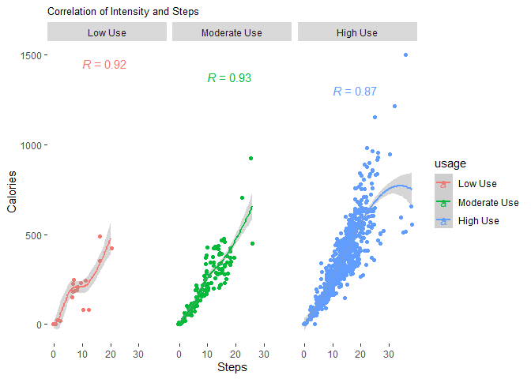<!-- -->

``` r
options(repr.plot.width = 14, repr.plot.height = 8)
```

#### **7.4. Steps vs Distance Across Groups**

``` r
#date for intensity v distance across groups
day_int <- hourly_cal_intensities_steps %>% 
   group_by(id, date) %>% 
  summarise(total_intensity = sum(total_intensity)) %>% 
  full_join(daily_activity_usage, by= c('id','date')) %>% 
  select('id','date','total_intensity','total_distance','usage')
```

    ## `summarise()` has grouped output by 'id'. You can override using the `.groups`
    ## argument.

``` r
head(day_int,3)
```

    ## # A tibble: 3 x 5
    ## # Groups:   id [1]
    ##           id date                total_intensity total_distance usage   
    ##        <dbl> <dttm>                        <int>          <dbl> <fct>   
    ## 1 1503960366 2016-04-12 00:00:00             429           8.5  High Use
    ## 2 1503960366 2016-04-13 00:00:00             318           6.97 High Use
    ## 3 1503960366 2016-04-14 00:00:00             293           6.74 High Use

``` r
ggplot(day_int, aes(x=total_intensity, y=total_distance, color = usage))+
  geom_jitter()+
  geom_smooth(method = 'loess', formulate = y ~ x)+
  stat_cor(aes(label = ..r.label..), label.x = 10)+
  labs(title = "Correlation of Intensity and Distance", x = "Distance(km)", y= "Calories") +
  theme(panel.background = element_blank(),
        plot.title = element_text( size=10))+
  facet_wrap(~usage)
```

    ## Warning: Ignoring unknown parameters: formulate

    ## `geom_smooth()` using formula 'y ~ x'

    ## Warning: Removed 6 rows containing non-finite values (stat_smooth).

    ## Warning: Removed 6 rows containing non-finite values (stat_cor).

    ## Warning: Removed 6 rows containing missing values (geom_point).

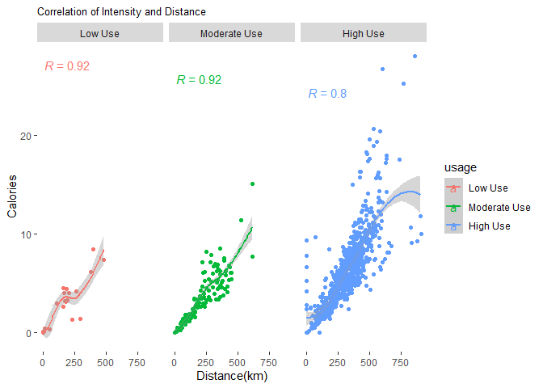<!-- -->

``` r
options(repr.plot.width = 14, repr.plot.height = 8)
```

**Observations for 7.3 & 7.4:** - There is a strong positive
correlations between intensity & distance and, intensity & steps among
all three Usage Groups. - Steps taken generally increase as Usage Groups
become more active - ‘High Usage’ participants display slightly less
significant correlations compared to the other two groups. This could be
due to these participants having a varied activities to keep active.
Metadata on the type of excercises they complete would be useful in
providing a deeper analysis. ### **8. Sleep Analysis** This set of plots
would delve a step deeper than the above plot by splitting the average
steps taken/hour across the different user groups.

#### **8.1. Sleep Distribution**

Here, we plot out the distribution of sleep for all participants based
on the number of hours of sleep recommended by the National Sleep
Foundation:

-   Below Recommended - \< 6 hours of sleep
-   Fairly Recommended - 6 and 7 hours of sleep
-   Recommended - 7 and 9 hours of sleep
-   Above Recommended - \> 9 hours of

``` r
#preparing data frame for sleep distribution
sleepday2 <- daily_sleep %>% 
  select(total_minutes_asleep) %>% 
  drop_na() %>% 
  mutate(sleep_quality = ifelse(total_minutes_asleep <= 360, 'Below Recommended',
                         ifelse(total_minutes_asleep <= 420,  'Fairly Recommended',
                         ifelse(total_minutes_asleep <= 540, 'Recommended', 'Above Recommended')))) %>% 
  mutate(sleep_quality = factor(sleep_quality,level = c('Below Recommended', 'Fairly Recommended',
                                    'Recommended','Above Recommended')))
head(sleepday2)
```

    ##   total_minutes_asleep      sleep_quality
    ## 1                  327  Below Recommended
    ## 2                  384 Fairly Recommended
    ## 3                  412 Fairly Recommended
    ## 4                  340  Below Recommended
    ## 5                  700  Above Recommended
    ## 6                  304  Below Recommended

``` r
ggplot(sleepday2,aes(x = total_minutes_asleep, fill = sleep_quality)) +
  geom_histogram(position = 'dodge', bins = 30) +
  scale_fill_manual(values=c("#7F58AF", "#64C5EB", "#E84D8A","#FEB326")) +
  theme_cleveland()+
  theme(legend.position = c(.80, .80),
        legend.title = element_blank(),
        legend.spacing.y = unit(0, "mm"), 
        panel.border = element_rect(colour = "White", fill=NA),
        legend.background = element_blank(),
        legend.box.background = element_rect(colour = "white")) +
  labs(title = "Sleep Distribution", x = "Time slept (minutes)",y = "Count",
       caption = 'Data Source: FitBit Fitness Tracker Data' 
  )
```

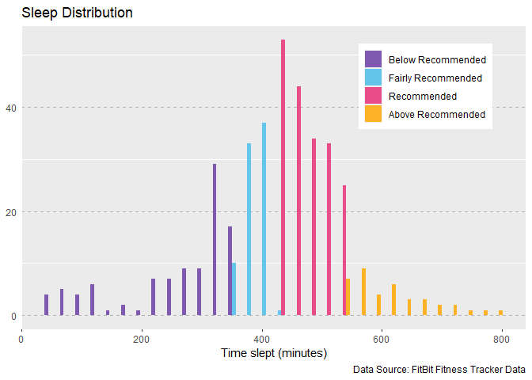<!-- -->

**Observations:**

-   Participants average hour of sleep follows a normal distribution,
    with majority sleeping 320-530 minutes or 6-9 hours.
-   There a more participants that receive ‘Below Recommended’ amounts
    of sleep than there those the receive ‘Above Recommended’ amounts of
    sleep.

#### **8.2. Average Sleep Hours by Day**

``` r
#data for sleep analysis
daily_sleep_minutes <- daily_sleep %>% 
  mutate(day = format(ymd(date), format = '%a')) %>% 
  select("day","total_minutes_asleep","total_time_in_bed") %>% 
  mutate(day = factor(day,level = c('Mon', 'Tue',
                                    'Wed','Thu', 'Fri', 'Sat', 'Sun')))%>% 
  group_by(day) %>% 
  summarise(minutes_asleep = round(mean(total_minutes_asleep)/60,2),
            time_in_bed = round(mean(total_time_in_bed)/60,2)) %>% 
  mutate(hours_asleep = round(seconds_to_period(minutes_asleep*60*60),-2))
head(daily_sleep_minutes,3)
```

    ## # A tibble: 3 x 4
    ##   day   minutes_asleep time_in_bed hours_asleep
    ##   <fct>          <dbl>       <dbl> <Period>    
    ## 1 Mon             6.99        7.62 6H 59M 0S   
    ## 2 Tue             6.74        7.39 6H 44M 0S   
    ## 3 Wed             7.24        7.83 7H 14M 0S

``` r
#data manipulation for avg_hours_sleep
sleepday3 <- daily_sleep %>%
  mutate(day = format(ymd(date), format = '%a')) %>% 
  mutate(time_awake_in_bed = total_time_in_bed - total_minutes_asleep) %>% 
 group_by(day) %>% 
  summarize(avg_hrs_asleep = round((mean(total_minutes_asleep/60)),2), 
            avg_hrs_in_bed = round((mean(total_time_in_bed/60)),2),
            avg_hrs_awake = round((mean(time_awake_in_bed/60)),2),
            std_hrs_in_bed = round((sd(total_minutes_asleep/60)),2),
            std_hrs_asleep = round((sd(total_time_in_bed/60)),2),
            std_hrs_awake = round((sd(time_awake_in_bed/60)),2)) %>%
mutate(day = factor(day, level = c('Mon', 'Tue', 'Wed','Thu', 'Fri', 'Sat', 'Sun')))

head(sleepday3)
```

    ## # A tibble: 6 x 7
    ##   day   avg_hrs_asleep avg_hrs_in_bed avg_hrs_awake std_hrs_in_bed
    ##   <fct>          <dbl>          <dbl>         <dbl>          <dbl>
    ## 1 Fri             6.76           7.42          0.66           1.88
    ## 2 Mon             6.99           7.62          0.63           2   
    ## 3 Sat             6.98           7.66          0.68           2.59
    ## 4 Sun             7.55           8.39          0.85           2.42
    ## 5 Thu             6.69           7.25          0.56           1.71
    ## 6 Tue             6.74           7.39          0.65           1.6 
    ## # ... with 2 more variables: std_hrs_asleep <dbl>, std_hrs_awake <dbl>

``` r
ggplot(sleepday3, aes(x = day, y= avg_hrs_asleep, fill = avg_hrs_asleep)) +
    geom_col(color="pink", size = 0.1) +
    geom_errorbar(mapping=aes(ymin = avg_hrs_asleep - 0.5 * (std_hrs_asleep), 
                            ymax = avg_hrs_asleep + 0.5 * (std_hrs_asleep), width = 0.5)) +
    geom_text(aes(label = avg_hrs_asleep, y =0.4), position = position_dodge(0.9), 
              size = 5, angle = 0,  color = "black", hjust = 0.5)+
    scale_fill_gradientn(limits=c(0,9), breaks=seq(0,9, by = 2), colours = brewer.pal(5, "Purples")) + 
    scale_y_continuous(limits=c(0,9), breaks=seq(0,9, by = 1))+
    labs(title= ("Average Hours Asleep"), subtitle = ('By Days'), y='Hours')+
    theme(plot.title=element_text(size = 16,hjust = 0))+
    theme(plot.subtitle=element_text(size = 14,hjust = 0))+
    theme(axis.text.y = element_text(size=16, hjust =  )) +
    theme(axis.text.x = element_text(size=16,hjust= 0.5, vjust = -2))+
    theme(axis.title.x = element_blank())+
    theme(axis.title.y = element_blank())+
    theme(legend.position = "right")+
    theme(legend.title=element_text(size=12))+
    theme(legend.text=element_text(size=8))
```

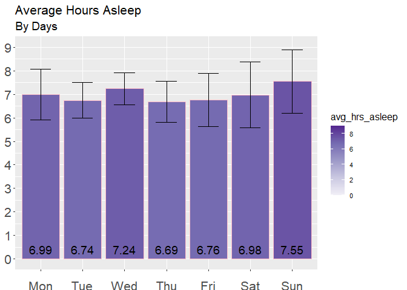<!-- -->

``` r
options(repr.plot.width = 6, repr.plot.height = 12)
```

**Observations:**

-   Thursdays are corresponds with the lowest amount of sleep, while
    Sunday corresponds with the highest.
-   The variability of sleep is also the highest on the weekends.
    Understadably so as it a non-working, rest day.
-   It is of note that Wednesday has the highest average sleep during
    the weekdays. Perhaps, participants are catching up on sleep after a
    busy start to the work week.

#### **8.3. Comparison of Sleep & In-Bed Hours**

Here we plot out the average sleep hours between the different Usage
Groups.

``` r
#data prep
sleep_day_usage <- daily_sleep %>% 
  left_join(daily_use2, by = 'id') %>%
  mutate(day = format(ymd(date), format = '%a')) %>% 
  group_by(day, usage) %>% 
  summarise(avg_hrs_asleep = round(mean(total_minutes_asleep)/60,2),
            avg_hrs_in_bed = round(mean(total_time_in_bed)/60,2),
            std_hrs_asleep = round((sd(total_minutes_asleep/60)),2),
            std_hrs_in_bed = round((sd(total_time_in_bed/60)),2)) %>% 
  mutate(day = factor(day, level = c('Mon', 'Tue', 'Wed','Thu', 'Fri', 'Sat', 'Sun')))
```

    ## `summarise()` has grouped output by 'day'. You can override using the `.groups`
    ## argument.

``` r
head(sleep_day_usage)
```

    ## # A tibble: 6 x 6
    ## # Groups:   day [3]
    ##   day   usage        avg_hrs_asleep avg_hrs_in_bed std_hrs_asleep std_hrs_in_bed
    ##   <fct> <fct>                 <dbl>          <dbl>          <dbl>          <dbl>
    ## 1 Fri   Low Use                6.42           6.8           NA             NA   
    ## 2 Fri   Moderate Use           7.28           8.32           1.41           2.98
    ## 3 Fri   High Use               6.66           7.26           1.98           2.12
    ## 4 Mon   Moderate Use           7.49           8.06           0.75           1.13
    ## 5 Mon   High Use               6.96           7.59           2.06           2.23
    ## 6 Sat   Low Use                1.28           1.28          NA             NA

``` r
ggplot(sleep_day_usage, aes(x = day, y= avg_hrs_asleep, fill = avg_hrs_asleep)) +
    geom_col(color="darkblue", size = 0.2) +
    geom_errorbar(mapping=aes(ymin = avg_hrs_asleep - 0.5 * (std_hrs_asleep), 
                            ymax = avg_hrs_asleep + 0.5 * (std_hrs_asleep), 
                            width = 0.5)) +
    geom_text(aes(label = avg_hrs_asleep, y =0.4), position = position_dodge(0.9), size = 4.5, angle = 0,  color = "black", hjust = 0.5)+
    scale_fill_gradientn(limits=c(0,9), breaks=seq(0,9, by = 2), colours = brewer.pal(5, "Purples")) + 
    scale_y_continuous(limits=c(0,9), breaks=seq(0,9, by = 1))+
    labs(title= ("Average Hours Asleep"), subtitle = ('By Group, Days'), x='Day', y='Hours')+
    theme(plot.title=element_text(size = 16,hjust = 0))+
    theme(plot.subtitle=element_text(size = 14,hjust = 0))+
    theme(axis.text.y=element_text(size=9)) +
    theme(axis.text.x=element_text(size=14,hjust= 0.5))+
    theme(axis.title.x = element_text(margin = margin(t = 14, r = 0, b = 0, l = 0)))+
    theme(axis.title.y = element_text(margin = margin(t = 0, r = 10, b = 0, l = 0)))+
    theme(legend.position = "top")+
    theme(legend.title=element_text(size=12))+
    theme(legend.text=element_text(size=8)) +
    facet_grid(~usage)
```

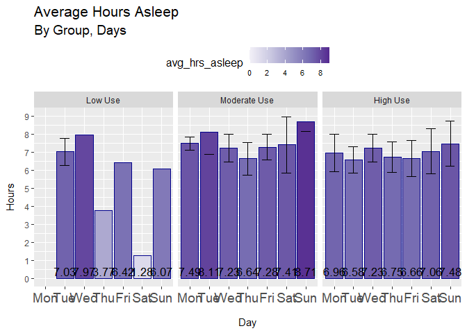<!-- -->

``` r
options(repr.plot.width = 14, repr.plot.height = 10)
```

**Observations:** - The ‘High Use’ group has a relatively lower average
hours of sleep. The variability of sleep for this group also follows a
more consistent pattern as oppose to other groups. - The ‘Moderate Use’
group has the highest average hours of sleep amongst all the groups. The
variability of sleep is inconsistent through the week, pointing to
various sleep patterns amongst its users. - The ‘Low Use’ group only has
a sample size of 1 and will not be considered for this analysis.

## Act Phase

### Answers for the Question of Analysis

**a) What are some trends in smart device usage?** The FitBit data set
confirms that not all users fully utilize the functions of their
devices/trackers. All 33 unique IDs used the step count function. 24/33
unique IDs used the sleep tracking function. 14/33 unique IDs used the
heart-rate tracking. 8/33 unique IDs used their devices to track their
weight. WIth the exception of the step count function, all other
functions were used irregularly throughout the data tracking period.
Hence, their omission from the analysis. [A survey by CCS
Insight](https://www.ccsinsight.com/press/company-news/1957-clear-marketing-needed-to-drive-sales-of-smartwatches-and-fitness-trackers/)
shed more light on this.

**b) High Use Group** This group consists of 24 users or 73% of the
total sample size, and wears the device regularly between 22-31 days.
This is the most active group, and also the most varied in the types of
exercises carried out. Varying from light, to moderate and vigorous
forms of exercises. They spent the most time amongst all other groups
being active, with a few outliers observed to complete full marathons
over the weekends (26 miles) They stick to routine with their activities
as well as have sufficient sleep. On average, they spend 21.2% of their
daily minutes being active (lightly, moderately and vigorously active).
Taking part in 35-40 mins of moderate to vigorous physical activities
(MVPA) minutes daily. Amounting to 240-280 MPVA minutes per week, well
above the recommended 150 MVPA minutes. Amongst all other groups, they
have the highest and also the widest range in calorie burned and steps
taken. Suggesting users are varied in the ways that they are active.
They are consistently active throughout the week with little significant
difference in activity minutes between weekdays and weekends, signifying
a habitual exercise routine.

**c) Moderate Use Group** This group consists of 7 users or 21% of the
total sample size, and wears the device between 15 - 21 days. Users in
this group are less active and walk fewer steps compared to the ‘High
Use’ group over the weekdays but active during the weekends, between
08:00AM to 1:00PM. While significantly less active than the ‘High Use’
group, they also stick to their routine and are able to have sufficient
sleep. On average, they spend 10.7% of their daily minutes being active
(lightly, moderately and vigorously active), more notably on Wednesdays
and Saturdays.

**d) Low Use Group** This group consists of only 2 users or 6% of the
sample size, too small to provide any meaningful analysis. Much of the
trends are skewed away from any recognizable patterns. With this in
mind, this group displays the lowest average distance and steps taken.
However a higher average intensity and calories burnt compared to the
‘Moderate Use’ group. Having much more active periods between 2:00PM to
10:00PM compared to moderate users. It is worth nothing that one
participant in this group does enjoy his/her Saturday nights and well
into the early hours of Sunday mornings (1:00AM - 3:00AM).

**e) Data Gaps** It is worth nothing that the analysis would be much
improved with the inclusion of crucial data such as location, gender,
ethnicity, labelling of types of physical activities, weather. The
exclusion of gender is especially egregious considering the nature of
the product sold, especially where women are incredibly underrepresented
in sports science.

### Recommendations

Bellabeat’s mission is to empower women by providing them with the data
to discover themselves.

**1) *“More than just a sports tracker”*** Users need to understand that
to get more out of the device, frequent use would facilitate better data
collection that can help bring more insights and actionable
recommendations. More research must be done to understand why they
‘Lower’ and ‘Moderate Use’ groups are not wearing their devices more
often. One such conclusion could point at the users perception that the
devices are only useful when worn during excercise or physical
activities. Marketing could focus on how the coupling of the ‘wellness’
and ‘sports’ elements can help bring a more holistic understanding of
their wellness and lifestyle habits. Product designers could focus on
gamifying features to encourage more frequent use in the devices. Having
smoother app to devices integration and syncing will help facilitate
this. Like how GoPro differentiates themselves from the rest of the pack
by having a comprehensive and user friendly app design.

**2) Socialization Features** With data obtained from hourly and daily
metrics. Users can be engaged further by receiving prompts on how they
are doing at the point of the day or week when compared to others in
their age/location/gender group. Congratulating users on meeting their
targets or encouraging them to go the extra mile. These could be some of
the prompts/push-notifications: - Good job! You’ve taken as many steps
as those in your age group! - Keep it up! You’re almost as active as you
were this time last week! - You’re not alone in this! You’re in the 50th
percentile of most active minutes this week! - Rest up! A good recovery
is just as important as a good run.

**3) Expanding device line-up** Most of Bellabeat’s products are devices
operate discretely without a screen. Most information have to be viewed
directly from the app and not from the devices itself. A whopping 94% of
users (Moderate & High Users) wear their devices more than 15 days in a
month. They would wear their devices throughout the day as well as their
during their workouts. This presents an opportunity for Bellabeat to
introduce a new line of smartwatches with touch screens focused on
‘every day’ wear. Together with their focus on women-centric products,
this choice seems obvious in differentiating them from the rest of the
pack.

**4) More inclusive studies needed** Insights on women’s health and
wellness were not represented in this study. Data on how women use these
devices and compared to men can reveal crucial insights for Bellabeat,
especially on features such as menstrual health.
