Fitness Tracker Trend Analysis
================
Adelia Ramadhani
1/11/2022

### **Overview**

[Bellabeat](https://bellabeat.com/?) is a women-centric tech and
wellness company which develops wearables and accompanying products that
monitor biometric and lifestyle data to help women better understand how
their bodies work, and as a result, make healthier lifestyle choices.

Together with the Bellabeat app, users are able to gain insights with
health data related to their activity, sleep, stress, fitness, heart
rate, reproductive health and mindfulness habits.

The aim of this project is to analyze how non-Bellabeat consumers use
their smart fitness devices. With this information, we are to provide
high-level recommendations for how these insights can inform Bellabeat’s
marketing strategy.

This analysis consists of 6 phase: **Ask, Prepare, Process, Analyze,
Share** and **Act**.

### **Ask Phase**

To begin the analysis, we need to ask questions and problem-solve. In
this Ask phase, we need to identify the business task, the questions
that needs to be answered, and the stakeholders. These aspects will
guide us through the entire process of the data analysis.

#### **1. Business Task**

-   Analyze Fitbit data to gain insight into how consumers use
    non-Bellabeat smart devices.

-   Select one Bellabeat product and apply these insights into a
    presentation. *(In this case study, we choose **Bellabeat App**).*

-   Provide high-level recommendations for Bellabeat’s marketing
    strategy.

#### **2. Questions for The Analysis**

-   What are some trends in smart device usage?

-   How could these trends apply to Bellabeat App customers?

-   How could these trends help influence Bellabeat’s marketing
    strategy?

#### **3. Stakeholders**

-   Urška Sršen: Bellabeat’s cofounder and Chief Creative Officer.

-   Sando Mur: Mathematician and Bellabeat’s cofounder.

-   Bellabeat Marketing Analytics team.

### **Prepare Phase**

This phase will help us to make use the right data for our objectives
and how to organize and protect the data so that we can process them in
the next phase.

#### **1. Data Sources**

The data source used for our case study is FitBit Fitness Tracker Data.
This dataset is stored in Kaggle and was made available through Mobius.

-   Source Used: [FitBit Fitness Tracker
    Data](https://www.kaggle.com/arashnic/fitbit) (CC0: Public Domain
    Kaggle dataset made available through Mobius,
    04.12.2016-05.12.2016).

-   [Original Source:](https://zenodo.org/record/53894#.Ybzqy9nMK8X)
    Furberg, R., Brinton, J., Keating, M., & Ortiz, A. (2016).
    Crowd-sourced Fitbit datasets 03.12.2016-05.12.2016 Zenodo.

#### **2. Accessibility and Privacy of the Data**

Verifying the metadata of our dataset we can confirm it is open-source.
The owner has dedicated the work to the public domain by waiving all of
their rights to the work worldwide under copyright law, including all
related and neighboring rights, to the extent allowed by law. We can
copy, modify, distribute and perform the work, even for commercial
purposes, all without asking permission.

#### **3. Other Information about the Dataset**

-   These datasets were generated by respondents to a distributed survey
    via Amazon Mechanical Turk between 03.12.2016-05.12.2016 **(31
    days).**

-   **Thirty** eligible Fitbit users consented to the submission of
    personal tracker data, including minute-level output for physical
    activity, heart rate, and sleep monitoring.

-   Variation between output represents use of different types of Fitbit
    trackers and individual tracking behaviors / preferences.

#### **4. Data Organization and Verification**

Available to us are 18 CSV documents. Each document represents different
quantitative data tracked by Fitbit. The data is considered long since
each row is one time point per subject, so each subject will have data
in multiple rows.Every user has a unique ID and different rows since
data is tracked by day and time.

Due to the small size of sample I sorted and filtered tables creating
Pivot Tables in Excel. I was able to verify attributes and observations
of each table and relations between tables. Counted sample size (users)
of each table and verified time length of analysis - 31 days.

|          **Table Name**          |      **Type**       |                                                                          **Description**                                                                          |
|:--------------------------------:|:-------------------:|:-----------------------------------------------------------------------------------------------------------------------------------------------------------------:|
|      `dailyActivity_merged`      | Microsoft Excel CSV |                                  Daily Activity over 31 days of 33 users. Tracking daily: Steps, Distance, Intensities, Calories                                  |
|      `dailyCalories_merged`      | Microsoft Excel CSV |                                                              Daily Calories over 31 days of 33 users                                                              |
|    `dailyIntensities_merged`     | Microsoft Excel CSV | Daily Intensity over 31 days of 33 users. Measured in Minutes and Distance, dividing groups in 4 categories: Sedentary, Lightly Active, Fairly Active,Very Active |
|       `dailySteps_merged`        | Microsoft Excel CSV |                                                               Daily Steps over 31 days of 33 users                                                                |
|    `heartrate_seconds_merged`    | Microsoft Excel CSV |                                                        Exact day and time heartrate logs for just 7 users                                                         |
|     `hourlyCalories_merged`      | Microsoft Excel CSV |                                                          Hourly Calories burned over 31 days of 33 users                                                          |
|    `hourlyIntensities_merged`    | Microsoft Excel CSV |                                                    Hourly total and average intensity over 31 days of 33 users                                                    |
|       `hourlySteps_merged`       | Microsoft Excel CSV |                                                               Hourly Steps over 31 days of 33 users                                                               |
|  `minuteCaloriesNarrow_merged`   | Microsoft Excel CSV |                                        Calories burned every minute over 31 days of 33 users (Every minute in single row)                                         |
|   `minuteCaloriesWide_merged`    | Microsoft Excel CSV |                                       Calories burned every minute over 31 days of 33 users (Every minute in single column)                                       |
| `minuteIntensitiesNarrow_merged` | Microsoft Excel CSV |                                         Intensity counted by minute over 31 days of 33 users (Every minute in single row)                                         |
|  `minuteIntensitiesWide_merged`  | Microsoft Excel CSV |                                       Intensity counted by minute over 31 days of 33 users (Every minute in single column)                                        |
|    `minuteMETsNarrow_merged`     | Microsoft Excel CSV |                     Ratio of the energy you are using in a physical activity compared to the energy you would use at rest. Counted in minutes                     |
|       `minuteSleep_merged`       | Microsoft Excel CSV |                                             Log Sleep by Minute for 24 users over 31 days. Value column not specified                                             |
|    `minuteStepsNarrow_merged`    | Microsoft Excel CSV |                                         Steps tracked every minute over 31 days of 33 users (Every minute in single row)                                          |
|     `minuteStepsWide_merged`     | Microsoft Excel CSV |                                        Steps tracked every minute over 31 days of 33 users (Every minute in single column)                                        |
|        `sleepDay_merged`         | Microsoft Excel CSV |                                    Daily sleep logs, tracked by: Total count of sleeps a day, Total minutes, Total Time in Bed                                    |
|      `weightLogInfo_merged`      | Microsoft Excel CSV |            Weight track by day in Kg and Pounds over 30 days. Calculation of BMI.5 users report weight manually 3 users not.In total there are 8 users            |

#### **5. Data Limitations**

-   **No Metadata Provided:** Information such as location, lifestyle,
    weather, temperature, humidity etc. would provide a deeper context
    to the data obtained.

-   **Missing Demographics:** Key demographics data such as gender, age,
    were not identified. This is a crucial missing information sine
    Bellabeat creates women-centric products. Insights obtained may not
    reflect the differences in physiology and activity patterns between
    different demographic groups. However, we understand such
    information is under a strict privacy policy.

-   **Small Sample Size:** Thirty users is not an ideal sample size
    where multiple independent variables are involved. Especially when
    health and lifestyle data is varied across different facets of
    society. Insights gained may not apply to all.

-   **Data Collection Period:** 31 days of data is limited in providing
    high-level recommendations. Seasonal trends impacts heavily on user
    activity and lifestyle choices. E.g. User’s exercise habits differ
    between summer and winter. Moreover, the data were collected 6 years
    ago, which is no longer current.

### **Process Phase**

In this phase, we will check, clean and transform the data, as well as
verify and report our cleaning results. Data processing, analysis and
visualization will all be done in R Programming with R Studio.

#### **1. Install Packages & Load Libraries Needed for Cleaning**

The libraries that we need to install are :

-   Tidyverse

-   Skimr

-   Tidyr

-   Lubridate

-   Janitor

-   Dplyr

-   Ggplot2

-   Ggpubr

-   Ggrepel

``` r
options(repos = list(CRAN="http://cran.rstudio.com/"))
install.packages("tidyverse")
```

    ## Installing package into 'C:/Users/IMBA/Dropbox/My PC (DESKTOP-U8M6E7I)/Documents/R/win-library/4.1'
    ## (as 'lib' is unspecified)

    ## package 'tidyverse' successfully unpacked and MD5 sums checked
    ## 
    ## The downloaded binary packages are in
    ##  C:\Users\IMBA\AppData\Local\Temp\RtmpUbEZi2\downloaded_packages

``` r
install.packages("skimr")
```

    ## Installing package into 'C:/Users/IMBA/Dropbox/My PC (DESKTOP-U8M6E7I)/Documents/R/win-library/4.1'
    ## (as 'lib' is unspecified)

    ## package 'skimr' successfully unpacked and MD5 sums checked
    ## 
    ## The downloaded binary packages are in
    ##  C:\Users\IMBA\AppData\Local\Temp\RtmpUbEZi2\downloaded_packages

``` r
install.packages("tidyr")
```

    ## Installing package into 'C:/Users/IMBA/Dropbox/My PC (DESKTOP-U8M6E7I)/Documents/R/win-library/4.1'
    ## (as 'lib' is unspecified)

    ## package 'tidyr' successfully unpacked and MD5 sums checked
    ## 
    ## The downloaded binary packages are in
    ##  C:\Users\IMBA\AppData\Local\Temp\RtmpUbEZi2\downloaded_packages

``` r
install.packages("lubridate")
```

    ## Installing package into 'C:/Users/IMBA/Dropbox/My PC (DESKTOP-U8M6E7I)/Documents/R/win-library/4.1'
    ## (as 'lib' is unspecified)

    ## package 'lubridate' successfully unpacked and MD5 sums checked
    ## 
    ## The downloaded binary packages are in
    ##  C:\Users\IMBA\AppData\Local\Temp\RtmpUbEZi2\downloaded_packages

``` r
install.packages("janitor")
```

    ## Installing package into 'C:/Users/IMBA/Dropbox/My PC (DESKTOP-U8M6E7I)/Documents/R/win-library/4.1'
    ## (as 'lib' is unspecified)

    ## package 'janitor' successfully unpacked and MD5 sums checked
    ## 
    ## The downloaded binary packages are in
    ##  C:\Users\IMBA\AppData\Local\Temp\RtmpUbEZi2\downloaded_packages

``` r
install.packages("dplyr")
```

    ## Installing package into 'C:/Users/IMBA/Dropbox/My PC (DESKTOP-U8M6E7I)/Documents/R/win-library/4.1'
    ## (as 'lib' is unspecified)

    ## package 'dplyr' successfully unpacked and MD5 sums checked

    ## Warning: cannot remove prior installation of package 'dplyr'

    ## Warning in file.copy(savedcopy, lib, recursive = TRUE): problem
    ## copying C:\Users\IMBA\Dropbox\My PC (DESKTOP-U8M6E7I)\Documents\R\win-
    ## library\4.1\00LOCK\dplyr\libs\x64\dplyr.dll to C:\Users\IMBA\Dropbox\My
    ## PC (DESKTOP-U8M6E7I)\Documents\R\win-library\4.1\dplyr\libs\x64\dplyr.dll:
    ## Permission denied

    ## Warning: restored 'dplyr'

    ## 
    ## The downloaded binary packages are in
    ##  C:\Users\IMBA\AppData\Local\Temp\RtmpUbEZi2\downloaded_packages

``` r
install.packages("ggplot2")
```

    ## Installing package into 'C:/Users/IMBA/Dropbox/My PC (DESKTOP-U8M6E7I)/Documents/R/win-library/4.1'
    ## (as 'lib' is unspecified)

    ## package 'ggplot2' successfully unpacked and MD5 sums checked
    ## 
    ## The downloaded binary packages are in
    ##  C:\Users\IMBA\AppData\Local\Temp\RtmpUbEZi2\downloaded_packages

``` r
install.packages("ggpubr")
```

    ## Installing package into 'C:/Users/IMBA/Dropbox/My PC (DESKTOP-U8M6E7I)/Documents/R/win-library/4.1'
    ## (as 'lib' is unspecified)

    ## package 'ggpubr' successfully unpacked and MD5 sums checked
    ## 
    ## The downloaded binary packages are in
    ##  C:\Users\IMBA\AppData\Local\Temp\RtmpUbEZi2\downloaded_packages

``` r
install.packages("ggrepel")
```

    ## Installing package into 'C:/Users/IMBA/Dropbox/My PC (DESKTOP-U8M6E7I)/Documents/R/win-library/4.1'
    ## (as 'lib' is unspecified)

    ## package 'ggrepel' successfully unpacked and MD5 sums checked

    ## Warning: cannot remove prior installation of package 'ggrepel'

    ## Warning in file.copy(savedcopy, lib, recursive = TRUE): problem
    ## copying C:\Users\IMBA\Dropbox\My PC (DESKTOP-U8M6E7I)\Documents\R\win-
    ## library\4.1\00LOCK\ggrepel\libs\x64\ggrepel.dll to C:\Users\IMBA\Dropbox\My
    ## PC (DESKTOP-U8M6E7I)\Documents\R\win-library\4.1\ggrepel\libs\x64\ggrepel.dll:
    ## Permission denied

    ## Warning: restored 'ggrepel'

    ## 
    ## The downloaded binary packages are in
    ##  C:\Users\IMBA\AppData\Local\Temp\RtmpUbEZi2\downloaded_packages

``` r
library("tidyverse")
```

    ## -- Attaching packages --------------------------------------- tidyverse 1.3.1 --

    ## v ggplot2 3.3.5     v purrr   0.3.4
    ## v tibble  3.1.6     v dplyr   1.0.7
    ## v tidyr   1.1.4     v stringr 1.4.0
    ## v readr   2.1.1     v forcats 0.5.1

    ## -- Conflicts ------------------------------------------ tidyverse_conflicts() --
    ## x dplyr::filter() masks stats::filter()
    ## x dplyr::lag()    masks stats::lag()

``` r
library("skimr")
library("tidyr")
library("lubridate")
```

    ## 
    ## Attaching package: 'lubridate'

    ## The following objects are masked from 'package:base':
    ## 
    ##     date, intersect, setdiff, union

``` r
library("janitor")
```

    ## 
    ## Attaching package: 'janitor'

    ## The following objects are masked from 'package:stats':
    ## 
    ##     chisq.test, fisher.test

``` r
library("dplyr")
library("ggplot2")
library("ggpubr")
library("ggrepel")
```

#### **2. Import Datasets**

Knowing the datasets we have, we will upload the datasets that will help
us answer our business task. On our analysis we will focus on the
following datasets:

-   Daily_activity

-   Daily_sleep

-   Hourly_steps

-   Hourly_intensities

-   Hourly_calories

Due to the the small sample we won’t consider for this analysis Weight
(8 Users) and heart rate (7 users)

``` r
daily_activity <- read.csv("dailyActivity_merged.csv")
daily_sleep <- read.csv("sleepDay_merged.csv")
hourly_steps <- read.csv("hourlySteps_merged.csv")
hourly_intensities <- read.csv("hourlyIntensities_merged.csv")
hourly_calories <- read.csv("hourlyCalories_merged.csv")
```

#### **3. Preview The Datasets**

This step will give us the preview about the name of each column and the
type of each data frame so that we can know what kind of data that we
have in a brief.

``` r
head(daily_activity)
```

    ##           Id ActivityDate TotalSteps TotalDistance TrackerDistance
    ## 1 1503960366    4/12/2016      13162          8.50            8.50
    ## 2 1503960366    4/13/2016      10735          6.97            6.97
    ## 3 1503960366    4/14/2016      10460          6.74            6.74
    ## 4 1503960366    4/15/2016       9762          6.28            6.28
    ## 5 1503960366    4/16/2016      12669          8.16            8.16
    ## 6 1503960366    4/17/2016       9705          6.48            6.48
    ##   LoggedActivitiesDistance VeryActiveDistance ModeratelyActiveDistance
    ## 1                        0               1.88                     0.55
    ## 2                        0               1.57                     0.69
    ## 3                        0               2.44                     0.40
    ## 4                        0               2.14                     1.26
    ## 5                        0               2.71                     0.41
    ## 6                        0               3.19                     0.78
    ##   LightActiveDistance SedentaryActiveDistance VeryActiveMinutes
    ## 1                6.06                       0                25
    ## 2                4.71                       0                21
    ## 3                3.91                       0                30
    ## 4                2.83                       0                29
    ## 5                5.04                       0                36
    ## 6                2.51                       0                38
    ##   FairlyActiveMinutes LightlyActiveMinutes SedentaryMinutes Calories
    ## 1                  13                  328              728     1985
    ## 2                  19                  217              776     1797
    ## 3                  11                  181             1218     1776
    ## 4                  34                  209              726     1745
    ## 5                  10                  221              773     1863
    ## 6                  20                  164              539     1728

``` r
str(daily_activity)
```

    ## 'data.frame':    940 obs. of  15 variables:
    ##  $ Id                      : num  1.5e+09 1.5e+09 1.5e+09 1.5e+09 1.5e+09 ...
    ##  $ ActivityDate            : chr  "4/12/2016" "4/13/2016" "4/14/2016" "4/15/2016" ...
    ##  $ TotalSteps              : int  13162 10735 10460 9762 12669 9705 13019 15506 10544 9819 ...
    ##  $ TotalDistance           : num  8.5 6.97 6.74 6.28 8.16 ...
    ##  $ TrackerDistance         : num  8.5 6.97 6.74 6.28 8.16 ...
    ##  $ LoggedActivitiesDistance: num  0 0 0 0 0 0 0 0 0 0 ...
    ##  $ VeryActiveDistance      : num  1.88 1.57 2.44 2.14 2.71 ...
    ##  $ ModeratelyActiveDistance: num  0.55 0.69 0.4 1.26 0.41 ...
    ##  $ LightActiveDistance     : num  6.06 4.71 3.91 2.83 5.04 ...
    ##  $ SedentaryActiveDistance : num  0 0 0 0 0 0 0 0 0 0 ...
    ##  $ VeryActiveMinutes       : int  25 21 30 29 36 38 42 50 28 19 ...
    ##  $ FairlyActiveMinutes     : int  13 19 11 34 10 20 16 31 12 8 ...
    ##  $ LightlyActiveMinutes    : int  328 217 181 209 221 164 233 264 205 211 ...
    ##  $ SedentaryMinutes        : int  728 776 1218 726 773 539 1149 775 818 838 ...
    ##  $ Calories                : int  1985 1797 1776 1745 1863 1728 1921 2035 1786 1775 ...

``` r
head(daily_sleep)
```

    ##           Id              SleepDay TotalSleepRecords TotalMinutesAsleep
    ## 1 1503960366 4/12/2016 12:00:00 AM                 1                327
    ## 2 1503960366 4/13/2016 12:00:00 AM                 2                384
    ## 3 1503960366 4/15/2016 12:00:00 AM                 1                412
    ## 4 1503960366 4/16/2016 12:00:00 AM                 2                340
    ## 5 1503960366 4/17/2016 12:00:00 AM                 1                700
    ## 6 1503960366 4/19/2016 12:00:00 AM                 1                304
    ##   TotalTimeInBed
    ## 1            346
    ## 2            407
    ## 3            442
    ## 4            367
    ## 5            712
    ## 6            320

``` r
str(daily_sleep)
```

    ## 'data.frame':    413 obs. of  5 variables:
    ##  $ Id                : num  1.5e+09 1.5e+09 1.5e+09 1.5e+09 1.5e+09 ...
    ##  $ SleepDay          : chr  "4/12/2016 12:00:00 AM" "4/13/2016 12:00:00 AM" "4/15/2016 12:00:00 AM" "4/16/2016 12:00:00 AM" ...
    ##  $ TotalSleepRecords : int  1 2 1 2 1 1 1 1 1 1 ...
    ##  $ TotalMinutesAsleep: int  327 384 412 340 700 304 360 325 361 430 ...
    ##  $ TotalTimeInBed    : int  346 407 442 367 712 320 377 364 384 449 ...

``` r
head(hourly_steps)
```

    ##           Id          ActivityHour StepTotal
    ## 1 1503960366 4/12/2016 12:00:00 AM       373
    ## 2 1503960366  4/12/2016 1:00:00 AM       160
    ## 3 1503960366  4/12/2016 2:00:00 AM       151
    ## 4 1503960366  4/12/2016 3:00:00 AM         0
    ## 5 1503960366  4/12/2016 4:00:00 AM         0
    ## 6 1503960366  4/12/2016 5:00:00 AM         0

``` r
str(hourly_steps)
```

    ## 'data.frame':    22099 obs. of  3 variables:
    ##  $ Id          : num  1.5e+09 1.5e+09 1.5e+09 1.5e+09 1.5e+09 ...
    ##  $ ActivityHour: chr  "4/12/2016 12:00:00 AM" "4/12/2016 1:00:00 AM" "4/12/2016 2:00:00 AM" "4/12/2016 3:00:00 AM" ...
    ##  $ StepTotal   : int  373 160 151 0 0 0 0 0 250 1864 ...

``` r
head(hourly_intensities)
```

    ##           Id          ActivityHour TotalIntensity AverageIntensity
    ## 1 1503960366 4/12/2016 12:00:00 AM             20         0.333333
    ## 2 1503960366  4/12/2016 1:00:00 AM              8         0.133333
    ## 3 1503960366  4/12/2016 2:00:00 AM              7         0.116667
    ## 4 1503960366  4/12/2016 3:00:00 AM              0         0.000000
    ## 5 1503960366  4/12/2016 4:00:00 AM              0         0.000000
    ## 6 1503960366  4/12/2016 5:00:00 AM              0         0.000000

``` r
str(hourly_intensities)
```

    ## 'data.frame':    22099 obs. of  4 variables:
    ##  $ Id              : num  1.5e+09 1.5e+09 1.5e+09 1.5e+09 1.5e+09 ...
    ##  $ ActivityHour    : chr  "4/12/2016 12:00:00 AM" "4/12/2016 1:00:00 AM" "4/12/2016 2:00:00 AM" "4/12/2016 3:00:00 AM" ...
    ##  $ TotalIntensity  : int  20 8 7 0 0 0 0 0 13 30 ...
    ##  $ AverageIntensity: num  0.333 0.133 0.117 0 0 ...

``` r
head(hourly_calories)
```

    ##           Id          ActivityHour Calories
    ## 1 1503960366 4/12/2016 12:00:00 AM       81
    ## 2 1503960366  4/12/2016 1:00:00 AM       61
    ## 3 1503960366  4/12/2016 2:00:00 AM       59
    ## 4 1503960366  4/12/2016 3:00:00 AM       47
    ## 5 1503960366  4/12/2016 4:00:00 AM       48
    ## 6 1503960366  4/12/2016 5:00:00 AM       48

``` r
str(hourly_calories)
```

    ## 'data.frame':    22099 obs. of  3 variables:
    ##  $ Id          : num  1.5e+09 1.5e+09 1.5e+09 1.5e+09 1.5e+09 ...
    ##  $ ActivityHour: chr  "4/12/2016 12:00:00 AM" "4/12/2016 1:00:00 AM" "4/12/2016 2:00:00 AM" "4/12/2016 3:00:00 AM" ...
    ##  $ Calories    : int  81 61 59 47 48 48 48 47 68 141 ...

#### **4. Clean The Name of The Columns in Each Table**

The column names need to be formatted consistently to make analysis
easier.

``` r
daily_activity <- clean_names(daily_activity)
daily_sleep <- clean_names(daily_sleep)
hourly_steps <- clean_names(hourly_steps)
hourly_intensities <- clean_names(hourly_intensities)
hourly_calories <- clean_names(hourly_calories)
```

#### **5. Remove Duplicates and N/A**

Data duplicates and N/A values can interfere with the analysis, so they
must be removed in order to make the data usable.

``` r
daily_activity <- daily_activity %>% 
  distinct() %>% 
  drop_na()

daily_sleep <- daily_sleep %>% 
  distinct() %>% 
  drop_na()

hourly_steps <- hourly_steps %>% 
  distinct() %>% 
  drop_na()

hourly_intensities <- hourly_intensities %>% 
  distinct() %>% 
  drop_na()

hourly_calories <- hourly_calories %>% 
  distinct() %>% 
  drop_na()
```

After the entire process, we should check if the duplicates were

#### **6. Change The Faulty Data Types**

After knowing each data type of the data frame, we should have known if
there was any incorrect data type. In this step, we need to correct
them.

``` r
daily_activity <- daily_activity %>%
  rename(date = activity_date) %>%
  mutate(date = as_date(date, format = "%m/%d/%Y"))
str(daily_activity)
```

    ## 'data.frame':    940 obs. of  15 variables:
    ##  $ id                        : num  1.5e+09 1.5e+09 1.5e+09 1.5e+09 1.5e+09 ...
    ##  $ date                      : Date, format: "2016-04-12" "2016-04-13" ...
    ##  $ total_steps               : int  13162 10735 10460 9762 12669 9705 13019 15506 10544 9819 ...
    ##  $ total_distance            : num  8.5 6.97 6.74 6.28 8.16 ...
    ##  $ tracker_distance          : num  8.5 6.97 6.74 6.28 8.16 ...
    ##  $ logged_activities_distance: num  0 0 0 0 0 0 0 0 0 0 ...
    ##  $ very_active_distance      : num  1.88 1.57 2.44 2.14 2.71 ...
    ##  $ moderately_active_distance: num  0.55 0.69 0.4 1.26 0.41 ...
    ##  $ light_active_distance     : num  6.06 4.71 3.91 2.83 5.04 ...
    ##  $ sedentary_active_distance : num  0 0 0 0 0 0 0 0 0 0 ...
    ##  $ very_active_minutes       : int  25 21 30 29 36 38 42 50 28 19 ...
    ##  $ fairly_active_minutes     : int  13 19 11 34 10 20 16 31 12 8 ...
    ##  $ lightly_active_minutes    : int  328 217 181 209 221 164 233 264 205 211 ...
    ##  $ sedentary_minutes         : int  728 776 1218 726 773 539 1149 775 818 838 ...
    ##  $ calories                  : int  1985 1797 1776 1745 1863 1728 1921 2035 1786 1775 ...

``` r
daily_sleep <- daily_sleep %>%
  rename(date = sleep_day) %>% 
  mutate(date = as_date(date, format = "%m/%d/%Y"))
str(daily_sleep)
```

    ## 'data.frame':    410 obs. of  5 variables:
    ##  $ id                  : num  1.5e+09 1.5e+09 1.5e+09 1.5e+09 1.5e+09 ...
    ##  $ date                : Date, format: "2016-04-12" "2016-04-13" ...
    ##  $ total_sleep_records : int  1 2 1 2 1 1 1 1 1 1 ...
    ##  $ total_minutes_asleep: int  327 384 412 340 700 304 360 325 361 430 ...
    ##  $ total_time_in_bed   : int  346 407 442 367 712 320 377 364 384 449 ...

``` r
hourly_calories <- hourly_calories %>% 
  rename(date_time = activity_hour) %>% 
  mutate(date_time = as.POSIXct(date_time, format = "%m/%d/%Y %I:%M:%S %p", tz = Sys.timezone()))
str(hourly_calories)
```

    ## 'data.frame':    22099 obs. of  3 variables:
    ##  $ id       : num  1.5e+09 1.5e+09 1.5e+09 1.5e+09 1.5e+09 ...
    ##  $ date_time: POSIXct, format: "2016-04-12 00:00:00" "2016-04-12 01:00:00" ...
    ##  $ calories : int  81 61 59 47 48 48 48 47 68 141 ...

``` r
hourly_intensities <- hourly_intensities %>% 
  rename(date_time = activity_hour) %>% 
  mutate(date_time = as.POSIXct(date_time, format = "%m/%d/%Y %I:%M:%S %p", tz = Sys.timezone()))
str(hourly_intensities)
```

    ## 'data.frame':    22099 obs. of  4 variables:
    ##  $ id               : num  1.5e+09 1.5e+09 1.5e+09 1.5e+09 1.5e+09 ...
    ##  $ date_time        : POSIXct, format: "2016-04-12 00:00:00" "2016-04-12 01:00:00" ...
    ##  $ total_intensity  : int  20 8 7 0 0 0 0 0 13 30 ...
    ##  $ average_intensity: num  0.333 0.133 0.117 0 0 ...

``` r
hourly_steps <- hourly_steps %>% 
  rename(date_time = activity_hour) %>% 
  mutate(date_time = as.POSIXct(date_time, format = "%m/%d/%Y %I:%M:%S %p", tz = Sys.timezone()))
str(hourly_steps)
```

    ## 'data.frame':    22099 obs. of  3 variables:
    ##  $ id        : num  1.5e+09 1.5e+09 1.5e+09 1.5e+09 1.5e+09 ...
    ##  $ date_time : POSIXct, format: "2016-04-12 00:00:00" "2016-04-12 01:00:00" ...
    ##  $ step_total: int  373 160 151 0 0 0 0 0 250 1864 ...

#### **7. Merge The Datasets**

Merging the datasets is needed to see if there is any correlation
between each data. In this step, we merge the datasets based on the time
it gets measured (daily or hourly).

``` r
daily_activity_sleep <- merge(daily_activity, daily_sleep, by = c("id", "date"))
glimpse (daily_activity_sleep)
```

    ## Rows: 410
    ## Columns: 18
    ## $ id                         <dbl> 1503960366, 1503960366, 1503960366, 1503960~
    ## $ date                       <date> 2016-04-12, 2016-04-13, 2016-04-15, 2016-0~
    ## $ total_steps                <int> 13162, 10735, 9762, 12669, 9705, 15506, 105~
    ## $ total_distance             <dbl> 8.50, 6.97, 6.28, 8.16, 6.48, 9.88, 6.68, 6~
    ## $ tracker_distance           <dbl> 8.50, 6.97, 6.28, 8.16, 6.48, 9.88, 6.68, 6~
    ## $ logged_activities_distance <dbl> 0, 0, 0, 0, 0, 0, 0, 0, 0, 0, 0, 0, 0, 0, 0~
    ## $ very_active_distance       <dbl> 1.88, 1.57, 2.14, 2.71, 3.19, 3.53, 1.96, 1~
    ## $ moderately_active_distance <dbl> 0.55, 0.69, 1.26, 0.41, 0.78, 1.32, 0.48, 0~
    ## $ light_active_distance      <dbl> 6.06, 4.71, 2.83, 5.04, 2.51, 5.03, 4.24, 4~
    ## $ sedentary_active_distance  <dbl> 0, 0, 0, 0, 0, 0, 0, 0, 0, 0, 0, 0, 0, 0, 0~
    ## $ very_active_minutes        <int> 25, 21, 29, 36, 38, 50, 28, 19, 41, 39, 73,~
    ## $ fairly_active_minutes      <int> 13, 19, 34, 10, 20, 31, 12, 8, 21, 5, 14, 2~
    ## $ lightly_active_minutes     <int> 328, 217, 209, 221, 164, 264, 205, 211, 262~
    ## $ sedentary_minutes          <int> 728, 776, 726, 773, 539, 775, 818, 838, 732~
    ## $ calories                   <int> 1985, 1797, 1745, 1863, 1728, 2035, 1786, 1~
    ## $ total_sleep_records        <int> 1, 2, 1, 2, 1, 1, 1, 1, 1, 1, 1, 1, 1, 1, 1~
    ## $ total_minutes_asleep       <int> 327, 384, 412, 340, 700, 304, 360, 325, 361~
    ## $ total_time_in_bed          <int> 346, 407, 442, 367, 712, 320, 377, 364, 384~

``` r
hourly_cal_intensities_steps <- hourly_calories %>% 
  left_join(hourly_intensities, by = c("id", "date_time")) %>% 
  left_join(hourly_steps, by = c("id", "date_time"))
glimpse(hourly_cal_intensities_steps)
```

    ## Rows: 22,099
    ## Columns: 6
    ## $ id                <dbl> 1503960366, 1503960366, 1503960366, 1503960366, 1503~
    ## $ date_time         <dttm> 2016-04-12 00:00:00, 2016-04-12 01:00:00, 2016-04-1~
    ## $ calories          <int> 81, 61, 59, 47, 48, 48, 48, 47, 68, 141, 99, 76, 73,~
    ## $ total_intensity   <int> 20, 8, 7, 0, 0, 0, 0, 0, 13, 30, 29, 12, 11, 6, 36, ~
    ## $ average_intensity <dbl> 0.333333, 0.133333, 0.116667, 0.000000, 0.000000, 0.~
    ## $ step_total        <int> 373, 160, 151, 0, 0, 0, 0, 0, 250, 1864, 676, 360, 2~

#### **8. Check Min (Date), Max (Date), and N/A Values**

``` r
min(daily_activity_sleep$date)
```

    ## [1] "2016-04-12"

``` r
max(daily_activity_sleep$date)
```

    ## [1] "2016-05-12"

``` r
n_unique(daily_activity_sleep$id)
```

    ## [1] 24

``` r
min(hourly_cal_intensities_steps$date_time)
```

    ## [1] "2016-04-12 +07"

``` r
max(hourly_cal_intensities_steps$date_time)
```

    ## [1] "2016-05-12 15:00:00 +07"

``` r
n_unique(hourly_cal_intensities_steps$id)
```

    ## [1] 33

### **Analysis and Share Phase**

We will analyze Fitbit user trends in order to come up with a better
marketing strategy for BellaBeat.

#### **1. Usage Group Distribution**

The purpose of this experiment is to determine how often participants
wear their watches. With `daily_activity_sleep`, we will determine the
type of users based on the daily `total_steps` they have taken. We will
assign the following designations:

-   Sedentary: \<5000 steps a day.

-   Lightly Active: 5000 - 7499 steps a day.

-   Fairly Active: 7500 - 9999 steps a day.

-   Very active: >10000 steps a day.

In making these classifications, we take into account the following
article: <https://www.10000steps.org.au/articles/counting-steps/>

We can gain a better understanding of each **Usage Group** by further
breaking down the analysis in this way.

-   Calculate the daily steps average for every user:

``` r
daily_average <- daily_activity_sleep %>%
  group_by(id) %>%
  summarise (mean_daily_steps = mean(total_steps), mean_daily_calories = mean(calories), mean_daily_sleep = mean(total_minutes_asleep))

head(daily_average)
```

    ## # A tibble: 6 x 4
    ##           id mean_daily_steps mean_daily_calories mean_daily_sleep
    ##        <dbl>            <dbl>               <dbl>            <dbl>
    ## 1 1503960366           12406.               1872.             360.
    ## 2 1644430081            7968.               2978.             294 
    ## 3 1844505072            3477                1676.             652 
    ## 4 1927972279            1490                2316.             417 
    ## 5 2026352035            5619.               1541.             506.
    ## 6 2320127002            5079                1804               61

-   Determine the user’s type based on the category above.

``` r
user_type <- daily_average %>%
  mutate(user_type = case_when(
    mean_daily_steps < 5000 ~ "sedentary",
    mean_daily_steps >= 5000 & mean_daily_steps < 7499 ~ "lightly active", 
    mean_daily_steps >= 7500 & mean_daily_steps < 9999 ~ "fairly active", 
    mean_daily_steps >= 10000 ~ "very active"
  ))

head(user_type)
```

    ## # A tibble: 6 x 5
    ##           id mean_daily_steps mean_daily_calories mean_daily_sleep user_type    
    ##        <dbl>            <dbl>               <dbl>            <dbl> <chr>        
    ## 1 1503960366           12406.               1872.             360. very active  
    ## 2 1644430081            7968.               2978.             294  fairly active
    ## 3 1844505072            3477                1676.             652  sedentary    
    ## 4 1927972279            1490                2316.             417  sedentary    
    ## 5 2026352035            5619.               1541.             506. lightly acti~
    ## 6 2320127002            5079                1804               61  lightly acti~

-   As soon as we have a new column with the user type, we will create a
    data frame with the percentage of each type of user so that the
    distribution can be visualized on a graph.

``` r
user_type_percent <- user_type %>%
  group_by(user_type) %>%
  summarise(total = n()) %>%
  mutate(totals = sum(total)) %>%
  group_by(user_type) %>%
  summarise(total_percent = total / totals) %>%
  mutate(labels = scales::percent(total_percent))

user_type_percent$user_type <- factor(user_type_percent$user_type , levels = c("very active", "fairly active", "lightly active", "sedentary"))

head(user_type_percent)
```

    ## # A tibble: 4 x 3
    ##   user_type      total_percent labels
    ##   <fct>                  <dbl> <chr> 
    ## 1 fairly active          0.375 38%   
    ## 2 lightly active         0.208 21%   
    ## 3 sedentary              0.208 21%   
    ## 4 very active            0.208 21%

-   Using the percentage of user types, we create the visualization.

``` r
user_type_percent %>%
  ggplot(aes(x="",y=total_percent, fill=user_type)) +
  geom_bar(stat = "identity", width = 1)+
  coord_polar("y", start=0)+
  theme_minimal()+
  theme(axis.title.x= element_blank(),
        axis.title.y = element_blank(),
        panel.border = element_blank(), 
        panel.grid = element_blank(), 
        axis.ticks = element_blank(),
        axis.text.x = element_blank(),
        plot.title = element_text(hjust = 0.5, size=14, face = "bold")) +
  scale_fill_manual(values = c("#E76F51","#F4A261", "#2A9D8F", "#264653")) +
  geom_text(aes(label = labels),
            position = position_stack(vjust = 0.5))+
  labs(title="User Type Distribution")
```

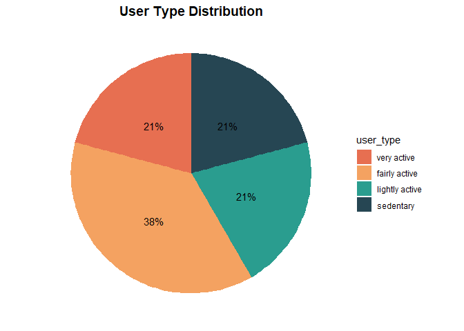<!-- -->

#### **2. The Number of Steps Taken and The Time (Minutes) Spent Asleep per Day.**

Currently, we’re trying to find out what days of the week users are more
active and what days of the week they sleep more. Additionally, we will
verify that the users got the recommended amount of sleep and walked the
recommended number of steps. The weekdays are calculated below based on
our column date. The average steps walked and minutes slept by weekday
are also calculated.

-   The day of the date can be obtained by creating a data
    transformation as below.

``` r
weekday_steps_sleep <- daily_activity_sleep %>%
  mutate(weekday = weekdays(date))

weekday_steps_sleep$weekday <-ordered(weekday_steps_sleep$weekday, levels=c("Monday", "Tuesday", "Wednesday", "Thursday","Friday", "Saturday", "Sunday"))

weekday_steps_sleep <-weekday_steps_sleep%>%
  group_by(weekday) %>%
  summarize (daily_steps = mean(total_steps), daily_sleep = mean(total_minutes_asleep))

head(weekday_steps_sleep)
```

    ## # A tibble: 6 x 3
    ##   weekday   daily_steps daily_sleep
    ##   <ord>           <dbl>       <dbl>
    ## 1 Monday          9273.        420.
    ## 2 Tuesday         9183.        405.
    ## 3 Wednesday       8023.        435.
    ## 4 Thursday        8184.        401.
    ## 5 Friday          7901.        405.
    ## 6 Saturday        9871.        419.

-   Create the visualization based on the data transformation above.

``` r
ggarrange(
  ggplot(weekday_steps_sleep) +
    geom_col(aes(weekday, daily_steps), fill = "#E76F51") +
    geom_hline(yintercept = 7500) +
    labs(title = "Daily steps per weekday", x= "", y = "") +
    theme(axis.text.x = element_text(angle = 45,vjust = 0.5, hjust = 1)),
  ggplot(weekday_steps_sleep, aes(weekday, daily_sleep)) +
    geom_col(fill = "#264653") +
    geom_hline(yintercept = 480) +
    labs(title = "Minutes asleep per weekday", x= "", y = "") +
    theme(axis.text.x = element_text(angle = 45,vjust = 0.5, hjust = 1))
)
```

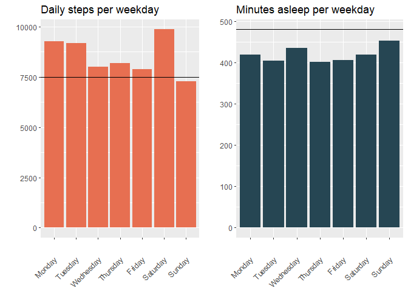<!-- -->

Based on the graphs above, we can draw the following conclusions:

-   Users walk daily the recommended amount of steps of 7500 besides
    Sunday’s.

-   Users don’t sleep the recommended amount of minutes/ hours - 8
    hours.

#### **3. Hourly Steps, Calories, and Intensities Throughout The Day**

In order to get a better understanding of our analysis, we would like to
know what time of day users are most active. We will use the
`hourly_steps` data frame and separate `date_time` column.

-   Separate date & time from `date_time` column to get hourly data.

``` r
hourly_cal_intensities_steps <- hourly_cal_intensities_steps %>%
  separate(date_time, into = c("date", "time"), sep= " ") %>%
  mutate(date = ymd(date)) 

head(hourly_cal_intensities_steps)
```

    ##           id       date     time calories total_intensity average_intensity
    ## 1 1503960366 2016-04-12 00:00:00       81              20          0.333333
    ## 2 1503960366 2016-04-12 01:00:00       61               8          0.133333
    ## 3 1503960366 2016-04-12 02:00:00       59               7          0.116667
    ## 4 1503960366 2016-04-12 03:00:00       47               0          0.000000
    ## 5 1503960366 2016-04-12 04:00:00       48               0          0.000000
    ## 6 1503960366 2016-04-12 05:00:00       48               0          0.000000
    ##   step_total
    ## 1        373
    ## 2        160
    ## 3        151
    ## 4          0
    ## 5          0
    ## 6          0

-   Create a visualization of hourly steps.

``` r
hourly_cal_intensities_steps %>%
  group_by(time) %>%
  summarize(average_steps = mean(step_total)) %>%
  ggplot() +
  geom_col(mapping = aes(x=time, y = average_steps, fill = average_steps)) + 
  labs(title = "Hourly steps throughout the day", x="", y="") + 
  scale_fill_gradient(low = "#2A9D8F", high = "#E76F51")+
  theme(axis.text.x = element_text(angle = 90))
```

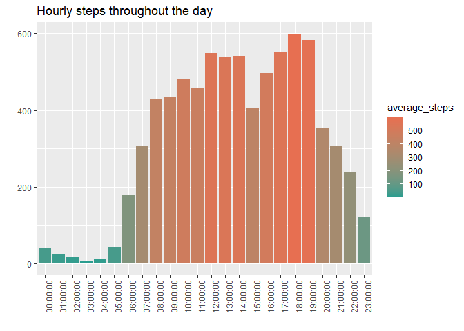<!-- -->

-   Create a visualization of hourly calories.

``` r
hourly_cal_intensities_steps %>%
  group_by(time) %>%
  summarize(average_cals = mean(calories)) %>%
  ggplot() +
  geom_col(mapping = aes(x=time, y = average_cals, fill = average_cals)) + 
  labs(title = "Hourly calories throughout the day", x="", y="") + 
  scale_fill_gradient(low = "#2A9D8F", high = "#E76F51")+
  theme(axis.text.x = element_text(angle = 90))
```

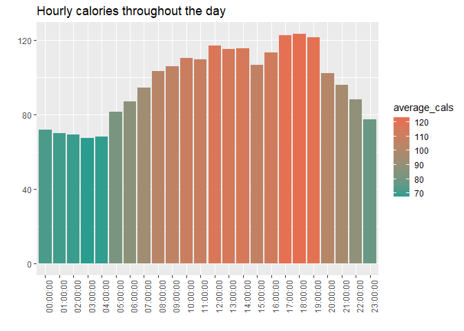<!-- -->

-   Create a visualization of hourly intensities.

``` r
hourly_cal_intensities_steps %>%
  group_by(time) %>%
  summarize(average_intensity = mean(average_intensity)) %>%
  ggplot() +
  geom_col(mapping = aes(x=time, y = average_intensity, fill = average_intensity)) + 
  labs(title = "Hourly calories throughout the day", x="", y="") + 
  scale_fill_gradient(low = "#2A9D8F", high = "#E76F51")+
  theme(axis.text.x = element_text(angle = 90))
```

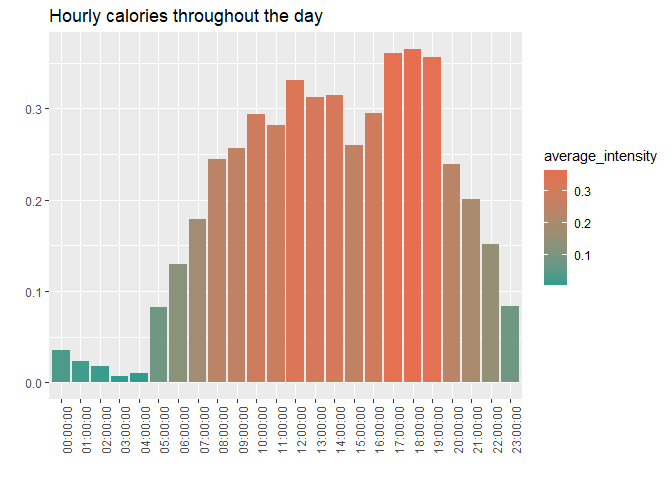<!-- -->

#### **4. Correlation Analysis**

We will now determine if there is any correlation between different
variables:

-   Daily steps and daily sleep

``` r
ggplot(daily_activity_sleep, aes(x=total_steps, y=total_minutes_asleep))+
  geom_point(alpha = 0.3, color = "#264653")+
  geom_smooth(method = "lm", se = TRUE,color = "2A9D8F") + 
  labs(title = "Daily steps vs Minutes asleep", x = "Daily steps", y= "Minutes asleep") +
  theme(panel.background = element_blank(),
        plot.title = element_text( size=14))
```

    ## `geom_smooth()` using formula 'y ~ x'

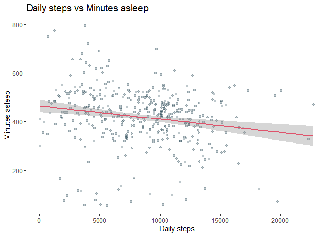<!-- -->

-   Daily steps and calories

``` r
ggplot(daily_activity_sleep, aes(x=total_steps, y=calories))+
  geom_point(alpha = 0.3, color = "#264653")+
  geom_smooth(method = "lm", se = TRUE, color = "2A9D8F") + 
  labs(title = "Daily steps vs Calories", x = "Daily steps", y= "Calories") +
  theme(panel.background = element_blank(),
        plot.title = element_text( size=14))
```

    ## `geom_smooth()` using formula 'y ~ x'

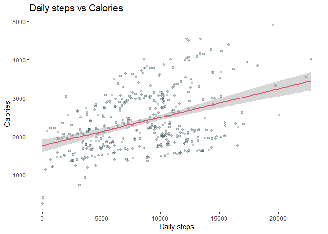<!-- -->

#### 5. The Usage of Smart Device

-   **The Number of Days People Use The Device**

    Having seen some trends in activity, sleep, and calories burned, we
    want to find out how often the users in our sample use their
    devices. We can then figure out what features are beneficial to
    smart devices and plan our marketing strategy.

    Assuming that the date interval is 31 days, we will calculate the
    number of users who use their smart devices every day, by
    classifying our sample into three groups:

    -   High use: Users who use their device between 21 and 31 days.

    -   Moderate use: Users who use their device between 10 and 20 days.

    -   Low use: Users who use their device between 1 and 10 days.

    First, we will create a new data frame grouping by `id`, calculating
    number of days used and creating a new column with the
    classification explained above.

    ``` r
    daily_use <- daily_activity_sleep %>%
      group_by(id) %>%
      summarize(days_used=sum(n())) %>%
      mutate(usage = case_when(
        days_used >= 1 & days_used <= 10 ~ "low use",
        days_used >= 11 & days_used <= 20 ~ "moderate use", 
        days_used >= 21 & days_used <= 31 ~ "high use", 
      ))

    head(daily_use)
    ```

        ## # A tibble: 6 x 3
        ##           id days_used usage   
        ##        <dbl>     <int> <chr>   
        ## 1 1503960366        25 high use
        ## 2 1644430081         4 low use 
        ## 3 1844505072         3 low use 
        ## 4 1927972279         5 low use 
        ## 5 2026352035        28 high use
        ## 6 2320127002         1 low use

    In order to better visualize the results in the graph, we will now
    create a percentage data frame. The usage levels will also be
    ordered.

    ``` r
    daily_use_percent <- daily_use %>%
      group_by(usage) %>%
      summarise(total = n()) %>%
      mutate(totals = sum(total)) %>%
      group_by(usage) %>%
      summarise(total_percent = total / totals) %>%
      mutate(labels = scales::percent(total_percent))

    daily_use_percent$usage <- factor(daily_use_percent$usage, levels = c("high use", "moderate use", "low use"))

    head(daily_use_percent)
    ```

        ## # A tibble: 3 x 3
        ##   usage        total_percent labels
        ##   <fct>                <dbl> <chr> 
        ## 1 high use             0.5   50%   
        ## 2 low use              0.375 38%   
        ## 3 moderate use         0.125 12%

    Once we have our new table, we can create our plot:

    ``` r
    daily_use_percent %>%
      ggplot(aes(x="",y=total_percent, fill=usage)) +
      geom_bar(stat = "identity", width = 1)+
      coord_polar("y", start=0)+
      theme_minimal()+
      theme(axis.title.x= element_blank(),
            axis.title.y = element_blank(),
            panel.border = element_blank(), 
            panel.grid = element_blank(), 
            axis.ticks = element_blank(),
            axis.text.x = element_blank(),
            plot.title = element_text(hjust = 0.5, size=14, face = "bold")) +
      geom_text(aes(label = labels),
                position = position_stack(vjust = 0.5))+
      scale_fill_manual(values = c("#E76F51","#F4A261","#2A9D8F"),
                        labels = c("High use - 21 to 31 days",
                                   "Moderate use - 11 to 20 days",
                                   "Low use - 1 to 10 days"))+
      labs(title="Daily use of smart device")
    ```

    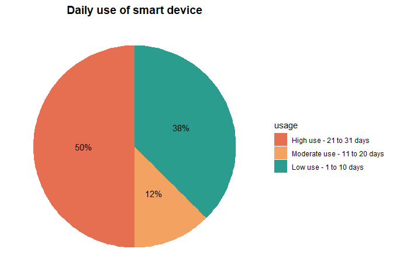<!-- -->

<!-- -->

-   **The Amount of Time (Minutes) People Use The Device**

    ``` r
    daily_use_merged <- merge(daily_activity_sleep, daily_use, by=c ("id"))
    head(daily_use_merged)
    ```

        ##           id       date total_steps total_distance tracker_distance
        ## 1 1503960366 2016-04-12       13162           8.50             8.50
        ## 2 1503960366 2016-04-13       10735           6.97             6.97
        ## 3 1503960366 2016-04-15        9762           6.28             6.28
        ## 4 1503960366 2016-04-16       12669           8.16             8.16
        ## 5 1503960366 2016-04-17        9705           6.48             6.48
        ## 6 1503960366 2016-04-19       15506           9.88             9.88
        ##   logged_activities_distance very_active_distance moderately_active_distance
        ## 1                          0                 1.88                       0.55
        ## 2                          0                 1.57                       0.69
        ## 3                          0                 2.14                       1.26
        ## 4                          0                 2.71                       0.41
        ## 5                          0                 3.19                       0.78
        ## 6                          0                 3.53                       1.32
        ##   light_active_distance sedentary_active_distance very_active_minutes
        ## 1                  6.06                         0                  25
        ## 2                  4.71                         0                  21
        ## 3                  2.83                         0                  29
        ## 4                  5.04                         0                  36
        ## 5                  2.51                         0                  38
        ## 6                  5.03                         0                  50
        ##   fairly_active_minutes lightly_active_minutes sedentary_minutes calories
        ## 1                    13                    328               728     1985
        ## 2                    19                    217               776     1797
        ## 3                    34                    209               726     1745
        ## 4                    10                    221               773     1863
        ## 5                    20                    164               539     1728
        ## 6                    31                    264               775     2035
        ##   total_sleep_records total_minutes_asleep total_time_in_bed days_used    usage
        ## 1                   1                  327               346        25 high use
        ## 2                   2                  384               407        25 high use
        ## 3                   1                  412               442        25 high use
        ## 4                   2                  340               367        25 high use
        ## 5                   1                  700               712        25 high use
        ## 6                   1                  304               320        25 high use

    ``` r
    minutes_worn <- daily_use_merged %>% 
      mutate(total_minutes_worn = very_active_minutes + fairly_active_minutes + lightly_active_minutes + sedentary_minutes)%>%
      mutate (percent_minutes_worn = (total_minutes_worn/1440)*100) %>%
      mutate (worn = case_when(
        percent_minutes_worn == 100 ~ "All day",
        percent_minutes_worn < 100 & percent_minutes_worn >= 50~ "More than half day", 
        percent_minutes_worn < 50 & percent_minutes_worn > 0 ~ "Less than half day"
      ))

    head(minutes_worn)
    ```

        ##           id       date total_steps total_distance tracker_distance
        ## 1 1503960366 2016-04-12       13162           8.50             8.50
        ## 2 1503960366 2016-04-13       10735           6.97             6.97
        ## 3 1503960366 2016-04-15        9762           6.28             6.28
        ## 4 1503960366 2016-04-16       12669           8.16             8.16
        ## 5 1503960366 2016-04-17        9705           6.48             6.48
        ## 6 1503960366 2016-04-19       15506           9.88             9.88
        ##   logged_activities_distance very_active_distance moderately_active_distance
        ## 1                          0                 1.88                       0.55
        ## 2                          0                 1.57                       0.69
        ## 3                          0                 2.14                       1.26
        ## 4                          0                 2.71                       0.41
        ## 5                          0                 3.19                       0.78
        ## 6                          0                 3.53                       1.32
        ##   light_active_distance sedentary_active_distance very_active_minutes
        ## 1                  6.06                         0                  25
        ## 2                  4.71                         0                  21
        ## 3                  2.83                         0                  29
        ## 4                  5.04                         0                  36
        ## 5                  2.51                         0                  38
        ## 6                  5.03                         0                  50
        ##   fairly_active_minutes lightly_active_minutes sedentary_minutes calories
        ## 1                    13                    328               728     1985
        ## 2                    19                    217               776     1797
        ## 3                    34                    209               726     1745
        ## 4                    10                    221               773     1863
        ## 5                    20                    164               539     1728
        ## 6                    31                    264               775     2035
        ##   total_sleep_records total_minutes_asleep total_time_in_bed days_used    usage
        ## 1                   1                  327               346        25 high use
        ## 2                   2                  384               407        25 high use
        ## 3                   1                  412               442        25 high use
        ## 4                   2                  340               367        25 high use
        ## 5                   1                  700               712        25 high use
        ## 6                   1                  304               320        25 high use
        ##   total_minutes_worn percent_minutes_worn               worn
        ## 1               1094             75.97222 More than half day
        ## 2               1033             71.73611 More than half day
        ## 3                998             69.30556 More than half day
        ## 4               1040             72.22222 More than half day
        ## 5                761             52.84722 More than half day
        ## 6               1120             77.77778 More than half day

<!-- -->

-   Create another data frames to support visualization.

``` r
minutes_worn_percent<- minutes_worn%>%
  group_by(worn) %>%
  summarise(total = n()) %>%
  mutate(totals = sum(total)) %>%
  group_by(worn) %>%
  summarise(total_percent = total / totals) %>%
  mutate(labels = scales::percent(total_percent))


minutes_worn_highuse <- minutes_worn%>%
  filter (usage == "high use")%>%
  group_by(worn) %>%
  summarise(total = n()) %>%
  mutate(totals = sum(total)) %>%
  group_by(worn) %>%
  summarise(total_percent = total / totals) %>%
  mutate(labels = scales::percent(total_percent))

minutes_worn_moduse <- minutes_worn%>%
  filter(usage == "moderate use") %>%
  group_by(worn) %>%
  summarise(total = n()) %>%
  mutate(totals = sum(total)) %>%
  group_by(worn) %>%
  summarise(total_percent = total / totals) %>%
  mutate(labels = scales::percent(total_percent))

minutes_worn_lowuse <- minutes_worn%>%
  filter (usage == "low use") %>%
  group_by(worn) %>%
  summarise(total = n()) %>%
  mutate(totals = sum(total)) %>%
  group_by(worn) %>%
  summarise(total_percent = total / totals) %>%
  mutate(labels = scales::percent(total_percent))

minutes_worn_highuse$worn <- factor(minutes_worn_highuse$worn, levels = c("All day", "More than half day", "Less than half day"))
minutes_worn_percent$worn <- factor(minutes_worn_percent$worn, levels = c("All day", "More than half day", "Less than half day"))
minutes_worn_moduse$worn <- factor(minutes_worn_moduse$worn, levels = c("All day", "More than half day", "Less than half day"))
minutes_worn_lowuse$worn <- factor(minutes_worn_lowuse$worn, levels = c("All day", "More than half day", "Less than half day"))

head(minutes_worn_percent)
```

    ## # A tibble: 2 x 3
    ##   worn               total_percent labels
    ##   <fct>                      <dbl> <chr> 
    ## 1 Less than half day        0.0488 5%    
    ## 2 More than half day        0.951  95%

``` r
head(minutes_worn_highuse)
```

    ## # A tibble: 2 x 3
    ##   worn               total_percent labels
    ##   <fct>                      <dbl> <chr> 
    ## 1 Less than half day        0.0457 5%    
    ## 2 More than half day        0.954  95%

``` r
head(minutes_worn_moduse)
```

    ## # A tibble: 2 x 3
    ##   worn               total_percent labels
    ##   <fct>                      <dbl> <chr> 
    ## 1 Less than half day        0.0417 4%    
    ## 2 More than half day        0.958  96%

``` r
head(minutes_worn_lowuse)
```

    ## # A tibble: 2 x 3
    ##   worn               total_percent labels
    ##   <fct>                      <dbl> <chr> 
    ## 1 Less than half day        0.0882 9%    
    ## 2 More than half day        0.912  91%

Analyzing our results we can see that:

50% of the users of our sample use their device frequently - between 21
to 31 days.

12% use their device 11 to 20 days.

38% of our sample use really rarely their device.

-   Create the visualizations.

``` r
ggplot(minutes_worn_percent, aes(x="",y=total_percent, fill=worn)) +
  geom_bar(stat = "identity", width = 1)+
  coord_polar("y", start=0)+
  theme_minimal()+
  theme(axis.title.x= element_blank(),
        axis.title.y = element_blank(),
        panel.border = element_blank(), 
        panel.grid = element_blank(), 
        axis.ticks = element_blank(),
        axis.text.x = element_blank(),
        plot.title = element_text(hjust = 0.5, size=14, face = "bold"),
        plot.subtitle = element_text(hjust = 0.5)) +
  scale_fill_manual(values = c("#E76F51", "#2A9D8F", "#cce6ff"))+
  geom_text(aes(label = labels),
            position = position_stack(vjust = 0.5), size = 3.5)+
  labs(title="Time worn per day", subtitle = "Total Users")
```

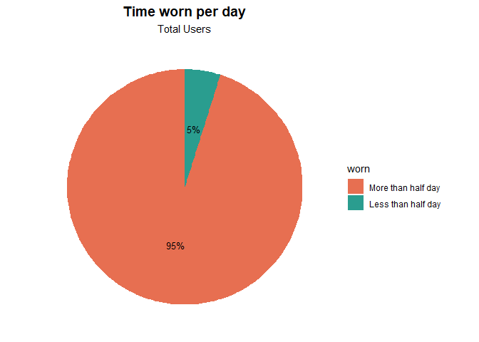<!-- -->

``` r
ggplot(minutes_worn_highuse, aes(x="",y=total_percent, fill=worn)) +
  geom_bar(stat = "identity", width = 1)+
  coord_polar("y", start=0)+
  theme_minimal()+
  theme(axis.title.x= element_blank(),
        axis.title.y = element_blank(),
        panel.border = element_blank(), 
        panel.grid = element_blank(),
        axis.ticks = element_blank(),
        axis.text.x = element_blank(),
        plot.title = element_text(hjust = 0.5, size=14, face = "bold"),
        plot.subtitle = element_text(hjust = 0.5))+
  scale_fill_manual(values = c("#E76F51", "#2A9D8F", "#cce6ff"))+
  geom_text_repel(aes(label = labels),
                  position = position_stack(vjust = 0.5), size = 3)+
  labs(title="", subtitle = "High Use - Users")
```

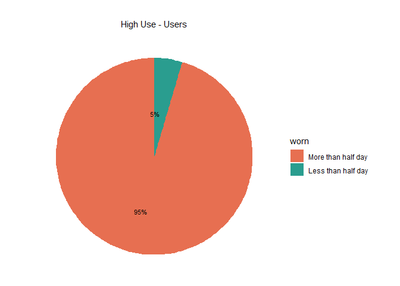<!-- -->

``` r
ggplot(minutes_worn_moduse, aes(x="",y=total_percent, fill=worn)) +
  geom_bar(stat = "identity", width = 1)+
  coord_polar("y", start=0)+
  theme_minimal()+
  theme(axis.title.x= element_blank(),
        axis.title.y = element_blank(),
        panel.border = element_blank(), 
        panel.grid = element_blank(), 
        axis.ticks = element_blank(),
        axis.text.x = element_blank(),
        plot.title = element_text(hjust = 0.5, size=14, face = "bold"), 
        plot.subtitle = element_text(hjust = 0.5)) +
  scale_fill_manual(values = c("#E76F51", "#2A9D8F", "#cce6ff"))+
  geom_text(aes(label = labels),
            position = position_stack(vjust = 0.5), size = 3)+
  labs(title="", subtitle = "Moderate use - Users")
```

<!-- -->

``` r
ggplot(minutes_worn_lowuse, aes(x="",y=total_percent, fill=worn)) +
  geom_bar(stat = "identity", width = 1)+
  coord_polar("y", start=0)+
  theme_minimal()+
  theme(axis.title.x= element_blank(),
        axis.title.y = element_blank(),
        panel.border = element_blank(), 
        panel.grid = element_blank(), 
        axis.ticks = element_blank(),
        axis.text.x = element_blank(),
        plot.title = element_text(hjust = 0.5, size=14, face = "bold"), 
        plot.subtitle = element_text(hjust = 0.5)) +
  scale_fill_manual(values = c("#E76F51", "#2A9D8F", "#cce6ff"))+
  geom_text(aes(label = labels),
            position = position_stack(vjust = 0.5), size = 3)+
  labs(title="", subtitle = "Low use - Users")
```

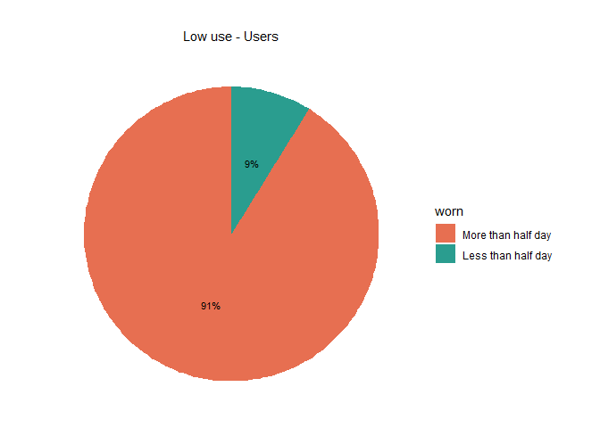<!-- -->

Per our plots we can see that 36% of the total of users wear the device
all day long, 60% more than half day long and just 4% less than half
day.

If we filter the total users considering the days they have used the
device and also check each day how long they have worn the device, we
have the following results:

Just a reminder:

-   high use - users who use their device between 21 and 31 days.

-   moderate use - users who use their device between 10 and 20 days.

-   low use - users who use their device between 1 and 10 days.

High users - Just 6.8% of the users that have used their device between
21 and 31 days wear it all day. 88.9% wear the device more than half day
but not all day.

Moderate users are the ones who wear the device less on a daily basis.

Being low users who wear more time their device the day they use it.

#### Act Phase (Conclusion)

Bellabeat’s mission is to empower women by providing them with the data
to discover themselves.

In order for us to respond to our business task and help Bellabeat on
their mission, based on our results, I would advice to use own tracking
data for further analysis. Datasets used have a small sample and can be
biased since we didn’t have any demographic details of users. Knowing
that our main target are young and adult women I would encourage to
continue finding trends to be able to create a marketing strategy
focused on them.

That being said, after our analysis we have found different trends that
may help our online campaign and improve **Bellabeat app**:

**1) ‘More than just a sports tracker’**

Users need to understand that to get more out of the device, frequent
use would facilitate better data collection that can help bring more
insights and actionable recommendations. More research must be done to
understand why they ‘Lower’ and ‘Moderate Use’ groups are not wearing
their devices more often. One such conclusion could point at the users
perception that the devices are only useful when worn during excercise
or physical activities.

Marketing could focus on how the coupling of the ‘wellness’ and ‘sports’
elements can help bring a more holistic understanding of their wellness
and lifestyle habits.

Product designers could focus on gamifying features to encourage more
frequent use in the devices. Having smoother app to devices integration
and syncing will help facilitate this. Like how GoPro differetiates
themselves from the rest of the pack by having a comprehensive and user
friendly app design.

**2) Socialisation Features**

With data obtained from hourly and daily metrics. Users can be engaged
further by receiving prompts on how they are doing at the point of the
day or week when compared to others in their age/location/gender group.
Congratulating users on meeting their targets or encouraging them to go
the extra mile. These could be some of the prompts/push-notifications:

-   Good job! You’ve taken as many steps as those in your age group!

-   Keep it up! You’re almost as active as you were this time last week!

-   You’re not alone in this! You’re in the 50th percentile of most
    active minutes this week!

-   Rest up! A good recovery is just as important as a good run.

**1) ‘More than just a sports tracker’**

Users need to understand that to get more out of the device, frequent
use would facilitate better data collection that can help bring more
insights and actionable recommendations. More research must be done to
understand why they ‘Lower’ and ‘Moderate Use’ groups are not wearing
their devices more often. One such conclusion could point at the users
perception that the devices are only useful when worn during excercise
or physical activities.

Marketing could focus on how the coupling of the ‘wellness’ and ‘sports’
elements can help bring a more holistic understanding of their wellness
and lifestyle habits.

Product designers could focus on gamifying features to encourage more
frequent use in the devices. Having smoother app to devices integration
and syncing will help facilitate this. Like how GoPro differetiates
themselves from the rest of the pack by having a comprehensive and user
friendly app design.

**2) Socialisation Features**

With data obtained from hourly and daily metrics. Users can be engaged
further by receiving prompts on how they are doing at the point of the
day or week when compared to others in their age/location/gender group.
Congratulating users on meeting their targets or encouraging them to go
the extra mile. These could be some of the prompts/push-notifications:

-   Good job! You’ve taken as many steps as those in your age group!

-   Keep it up! You’re almost as active as you were this time last week!

-   You’re not alone in this! You’re in the 50th percentile of most
    active minutes this week!

-   Rest up! A good recovery is just as important as a good run.

**3) Expanding device line-up**

Most of Bellabeat’s products are devices operate discretely without a
screen. Most information have to be viewed directly from the app and not
from the devices itself. A whopping 94% of users (Moderate & High Users)
wear their devices more than 15 days in a month. They would wear their
devices throughout the day as well as their during their workouts. This
presents an opportunity for Bellabeat to introduce a new line of
smartwatches with touch screens focused on ‘every day’ wear. Together
with their focus on women-centric products, this choice seems obvious in
differentiating them from the rest of the pack.

**4) More inclusive studies needed**

Insights on women’s health and wellness were not represented in this
study. Data on how women use these devices and compared to men can
reveal crucial insights for Bellabeat, especially on features such as
menstrual health. I alone, a cisgender man, would bring a limited if not
harmful assessment of this data.
